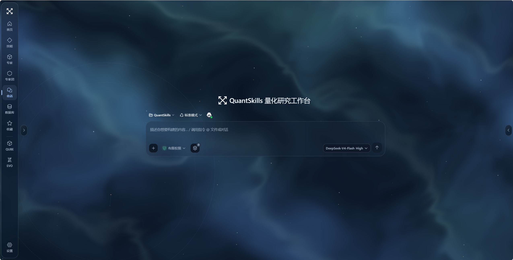
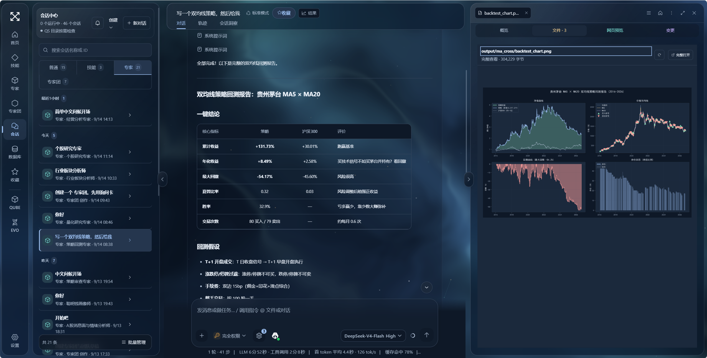

<b>Skills, experts, data and deliverables. One workspace.</b>

<a href="README.md">简体中文</a> · <a href="#get-started">Get started</a> · <a href="RELEASE_NOTES.md">Release notes</a>

<a href="https://github.com/quantskills/QuantStudio">GitHub</a> · <a href="https://gitee.com/quantskills/QuantStudio">Gitee mirror</a> · <a href="https://github.com/songshuquant/QuantStudio">songshuquant mirror</a>

## Meet QuantStudio

QuantStudio is a local AI workspace from QuantSkills / PandaAI for quantitative research and everyday office work. Describe a task, select reusable skills, work with an expert or expert team, and inspect the resulting reports, charts, code and data in the same interface.

The application integrates a pinned DSH runtime, its own interface and a launcher. Installing the project dependencies provides the runtime; no separate DSH setup is needed. Sessions, your capability library and working files stay on your computer. Model calls and external data requests use the services you configure.

## Work from a question to a deliverable

| Task | Workflow |
| --- | --- |
| Evaluate a strategy or factor | Specify instruments, dates and rules; inspect data, backtest results and reproducible code. |
| Research a company, industry or event | Assign collection, analysis and review to relevant experts, then assemble a report with evidence. |
| Prepare documents, spreadsheets and presentations | Attach source files and work with office specialists to produce editable deliverables. |
| Reuse a proven process | Save a skill, package it with a role as an expert, or coordinate several experts as a team. |
| Reuse research data | Browse local market, news, fundamental and other data; preview, refresh, delete or clear cached entries. |

Data requests check the local cache first and refresh when freshness, date coverage or row count is insufficient. PandaData and other sources require the relevant configuration and access.

## Skills, experts and teams

A **skill** defines a repeatable method. An **expert** combines a role with skills. An **expert team** assigns a lead and members to a shared objective. Each has a dedicated navigation entry; the conversation picker supports authored, recommended, installed and discoverable capabilities.

The verified portable snapshot includes **15 skills, 44 expert definitions and 14 teams**, including authoring assistants. It preserves versions and bindings without model credentials or session history. Quantitative research, company and industry analysis, news, documents, spreadsheets and office collaboration are covered. You can create your own definitions manually or review an AI-generated draft before saving it.

Application updates do not restore this snapshot over your personal library. [Snapshot and import instructions](docs/library-snapshot.md).

## A complete workspace

- **Conversations beside deliverables**: inspect Markdown, HTML, PDF, tables and code. Double-click images to enlarge them and use the wheel to zoom.
- **Coordinated themes**: mist blue is the default, alongside other dark palettes, pale blue glass, rainy and ink themes. Controls, text, icons, panels and artifact generation guidance follow the palette.
- **Interactive backgrounds**: fluid motion, particles and ripples, with pause controls and reduced-motion support.
- **Responsive layouts**: navigation and side panels adapt to narrow screens so conversations remain readable.
- **Model setup**: first-run guidance appears when no model is configured. You manage model and data-source credentials locally.

## Get started

Install Git and Node.js **22.19 or newer within 22.x, or version 24 and above**. The project pins pnpm 11.7.0 and DSH 0.1.2-alpha.2 and includes installable build output.

~~~sh
git clone -c core.longpaths=true https://github.com/quantskills/QuantStudio.git
cd QuantStudio
corepack enable
pnpm install --frozen-lockfile
pnpm run web
~~~

For the China mirror, replace the clone command with:

~~~sh
git clone -c core.longpaths=true https://gitee.com/quantskills/QuantStudio.git
~~~

After launch, open the local address printed in the terminal, for example [http://127.0.0.1:3198/](http://127.0.0.1:3198/). Local browsers do not require copying a token; remote and proxied requests retain origin and authentication checks. Configure a model, then choose an expert or start a conversation.

Configure Python and data services when a task needs them. Ordinary conversations do not require Python or a PandaData login. Run all commands from the repository root.

## Updates that preserve your work

The home page automatically checks stable releases from your selected GitHub or Gitee source. Manual checks are also available. **The update button changes color when a release is available and shows its version and release notes.** Downloading requires confirmation.

| Updated | Preserved |
| --- | --- |
| Application code, UI, runtime packages and built-in recommended templates | Authored and installed skills, experts and teams |
| Release assets and verified dependencies | Sessions, cached data, model settings and credentials |
| The managed application version | Workspace files and generated deliverables |

Candidates are downloaded into a separate directory, installed, type-checked and smoke-tested before activation on the next normal launch. Failed startup rolls back to the previous version. Untagged main commits are not installable releases.

**Migrating from the legacy repository:** QuantStudio has an independent Git history. Clone into a new directory and keep the same DSH_HOME and workspaces. Do not force-pull or reset the legacy checkout. Custom branches, local edits and diverged histories remain protected. Snapshot restoration is explicit and requires an empty capability library.

## PandaAI products

| Product | Intended workflow | Link |
| --- | --- | --- |
| QUBE | Natural-language strategy creation, backtests and rapid validation | [Try QUBE](https://www.pandaaiquant.com/agent_quant/) |
| EVO | Ongoing factor and strategy research with a managed research environment | [Try EVO](https://www.pandaaiquant.com/evo/) |

In-app introduction pages include real interface images and a button to open each service.

## Development and verification

~~~sh
pnpm run check
pnpm run test
pnpm run test:update
pnpm run ci:smoke
~~~

After a release is published:

~~~sh
pnpm run verify:update-mirrors
pnpm run verify:update-live github
pnpm run verify:update-live gitee
~~~

The live verification uses temporary directories to exercise anonymous discovery, downloading, installation, activation and preservation of personal data. Source is in src/ and packages/, build output in lib/, and the portable library in assets/library-v2/. [Runtime baseline](SOURCE_BASELINE.md) · [Publishing and mirrors](docs/publishing.md).

## License

QuantStudio is offered under [GPL-3.0-or-later](LICENSE) or a separate [PandaAI commercial license](COMMERCIAL-LICENSE.md). DSH and other third-party components retain their own licenses and copyright notices; see [Third-Party Notices](THIRD_PARTY_NOTICES.md) and LICENSES/.

This repository is maintained by QuantSkills with an independent release history. Reinitializing Git history does not change third-party provenance or licensing.

## Windows and macOS

Both platforms use `pnpm run web`. macOS does not require PowerShell; Windows supports Windows PowerShell and PowerShell 7. The default workspace is the Windows Documents known folder or `~/Documents/QuantSkills` on macOS. Configuration is stored under `~/.dsh` unless `DSH_HOME` is set. On macOS, allow the terminal to access Documents if prompted by the operating system.
