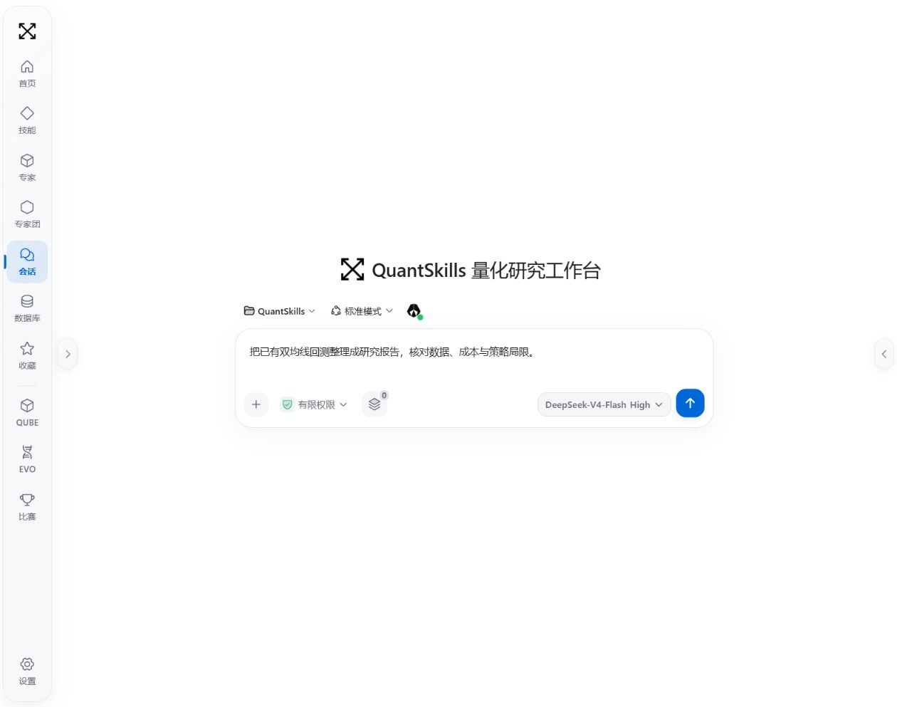
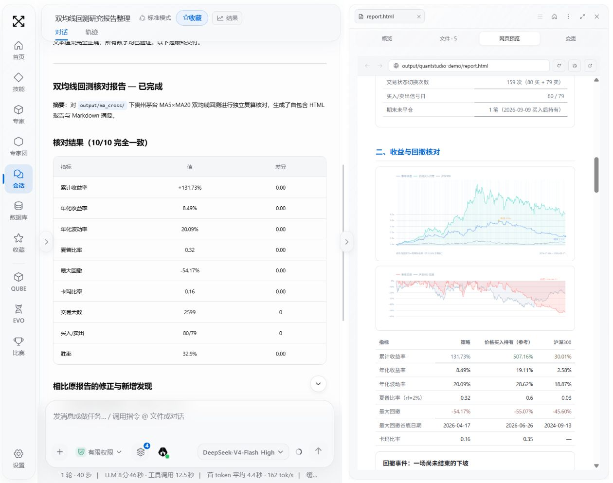
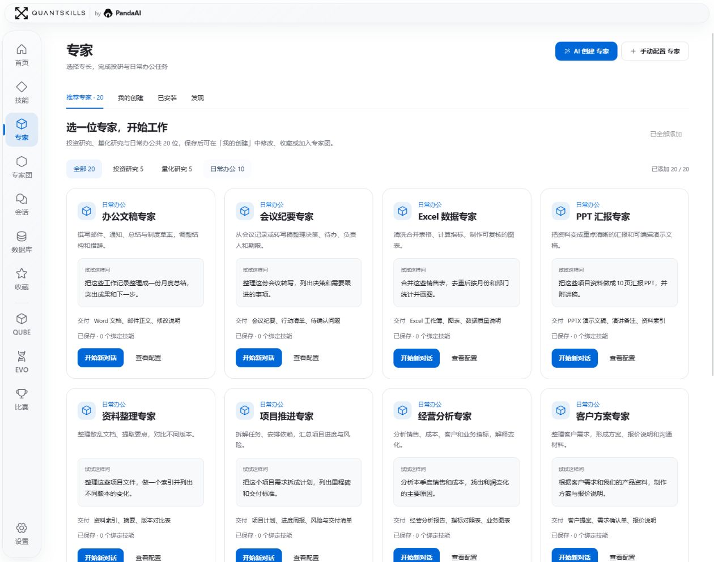
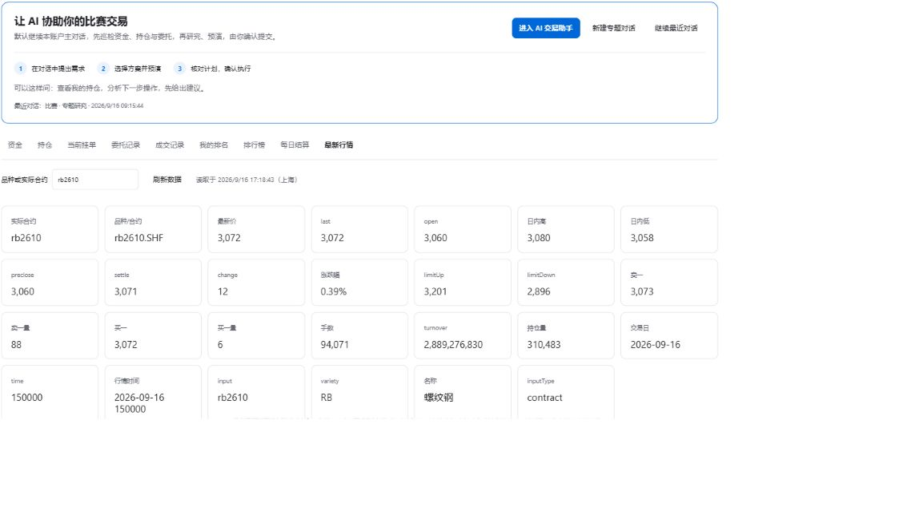
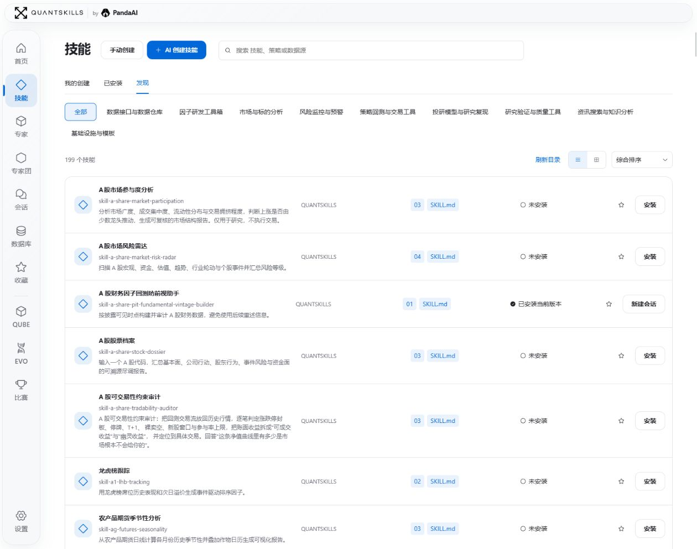
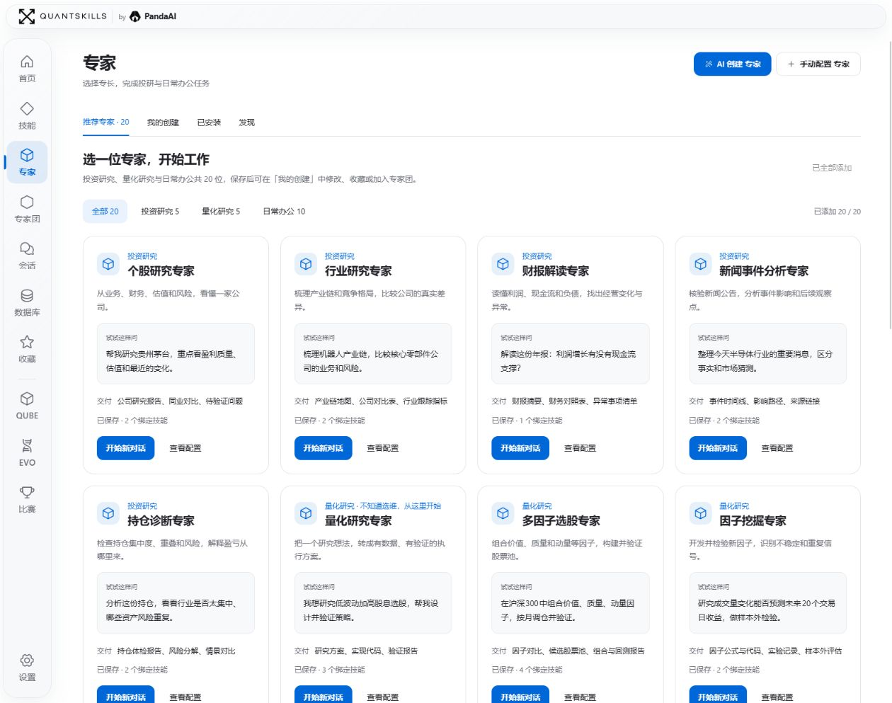
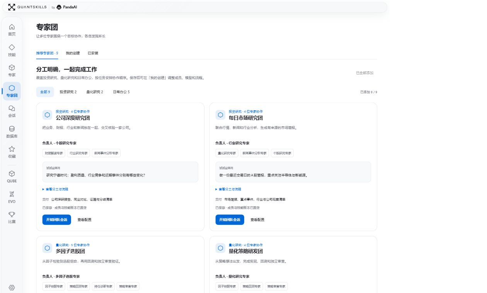
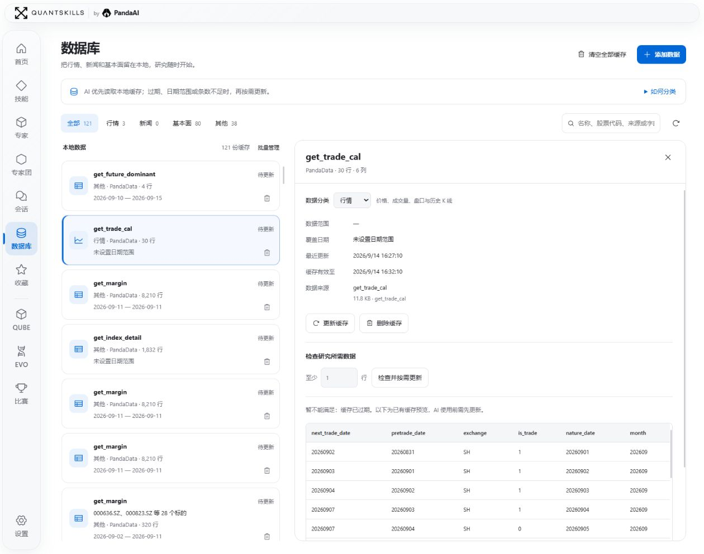

<div align="center">

# QuantStudio

### Your personal, open-source quant workspace for the AI era.

**Quant · Work · Trade**

From QuantSkills, an open-source community under PandaAI

[Get started](#get-started) · [Jev monitoring](#jev-market-monitoring-and-proposal-evaluation) · [简体中文](README.md) · [GitHub](https://github.com/quantskills/QuantStudio) · [Gitee](https://gitee.com/quantskills/QuantStudio)



</div>

**Research methods, specialists, team collaboration and deliverables in one workspace.**

Describe a task, load a skill, choose a specialist or assemble a team. Follow the conversation and execution trace, then inspect the reports, charts, code and files produced. QuantStudio runs locally on Windows, macOS and Linux, and can also be deployed as a shared team workspace. The QuantSkills branding in the current interface identifies its community and capability ecosystem.

## Quant · Work · Trade

| Area | Tasks | Deliverables |
| --- | --- | --- |
| **Quant** | Market reviews, event tracking, capital flows, factor research, strategy development and backtest audits | Research reports, factor evaluations, charts, code and data |
| **Work** | Document preparation, spreadsheet cleanup, meeting notes, business analysis and presentations | Documents, workbooks, slide decks and action lists |
| **Trade** | Futures simulation account inspection, contract research, trade previews and factor competition research | Confirmation plans, execution receipts, research batches and factor pool records |

### Research with results you can inspect

Ask the assistant to turn existing backtest files into a report, check costs and explain limitations. Open the HTML report beside the conversation to examine its charts and tables while continuing the analysis.



This screenshot shows a review of existing historical backtest files, not a promise of future performance.

### Turn working materials into deliverables

Use specialists for spreadsheets, meeting notes, writing, presentations, business analysis and customer proposals. Teams can divide larger reporting and delivery tasks. Supported output formats depend on the configured model, skills and document tools.



### Research and preview before confirming

Connect to the futures simulation competition or the fourth factor competition through **PandaAI CLI and competition APIs**. Each has its own account connection and research conversations.

- **Futures simulation:** inspect funds, positions, orders, fills, rankings and quotes. The assistant proposes plans; the user reviews and confirms opening, closing or cancelling orders. Automatic account inspection is read-only.
- **Factor competition:** agree on a research batch and budget, inspect backtests, compare candidates and manage the factor pool. Pool changes and competition submissions use confirmation plans. The compute threshold stops additional work; it is not a guaranteed spending cap.



Accounts, Python and appropriate permissions are required. [Futures guide](docs/contest.md) · [Factor competition guide](docs/factor-contest.md)

### Jev: market monitoring and proposal evaluation

QuantStudio integrates [TypeSafe Jev](https://docs.typesafe.ai/introduction), bringing market sampling, strategy evaluation, account inspection and confirmation plans into the futures simulation workspace. Jev evaluates completed bars, live quote snapshots, positions and strategy constraints to suggest holding, opening a long or short position, or closing an existing position. Inspect the evidence before deciding whether to execute a plan.

See the [Jev monitoring guide](docs/contest.md#jev-持续盯盘与自动计划) for configuration and operation details.

| Capability | What it does |
| --- | --- |
| **Strategy templates** | Choose range mean reversion, trend pullback or breakout following, or create and save your own strategy. Configure the contract, size, sampling frequency and decision interval. |
| **Continuous monitoring** | Prepare minute bars through PandaData and analyze them alongside live competition quotes, funds, positions and open orders. |
| **Reviewable decisions** | Inspect market regime, strategy fit, blockers, action probabilities and analysis history. Distinguish missing data, program constraints and the model's decision to hold. |
| **Constraints and modes** | Set permitted directions, spread limits, opening cooldown, plan limits and an equity-drop stop. Autonomous mode lets Jev weigh strategy evidence; strict mode applies strategy gates first. Both retain account and data-validity checks. |
| **Plans and receipts** | Generate a confirmation plan when conditions permit. Recheck the account and quotes before preparation, then track orders and fills after the user confirms submission. |

Open **Competitions → Futures simulation → Jev monitoring**, configure your TypeSafe API key, connect the competition account and PandaData, then select a template and review its parameters before starting. Keys are stored in the local credential store. The interface shows request records and reported token usage. Custom Chinese strategy text can be translated with a selected, verified model while preserving the original; translation and Jev calls incur separate usage.

Dedicated competition conversations can also ask Jev to assess a proposal's evidence, support and risk. **Monitoring analyzes data and prepares plans; every trade still requires user confirmation.** The equity-drop stop pauses monitoring without automatically closing positions. Action probabilities and confidence describe the model's judgment, not a trading win rate. The current futures CLI integration supports local Windows and macOS installations.

## Skills, specialists and teams

**Skills** capture reusable methods, steps and tool conventions. Discover and install existing skills, or describe a workflow for AI to draft and save after confirmation.



**Specialists** combine responsibilities, instructions and skills into a focused role with its own conversations. Choose an existing equity, financial statement, factor, strategy or office specialist, or create your own.



**Teams** define a lead, members, dependencies and expected outputs. Start from a company research or market review team, or describe a goal and confirm an AI-generated team draft before starting collaboration.



The portable library snapshot includes **15 skills, 44 specialist definitions and 14 teams**. It is separate from the online catalog and recommendations. It contains no model keys or conversation history and is imported into an empty library only on explicit request. [Snapshot guide](docs/library-snapshot.md).

## Data and results in your workspace

Search local market, news and fundamental data caches, inspect their sources and dates, preview tables, and refresh or remove them. Research checks existing caches before requesting missing or stale data.



The result workbench previews HTML, Markdown, PDF, images, code and data files. Resize or collapse panels, inspect outputs and download them.

| Section | Purpose |
| --- | --- |
| Home | Discover capabilities and resume recent work. |
| Skills | Discover, install, create and manage reusable methods. |
| Specialists | Configure a role and its skills; start or resume conversations. |
| Teams | Coordinate members, responsibilities and workflows. |
| Conversations | Manage ordinary, skill, specialist and team conversations; inspect traces and results. |
| Database | Search, preview and manage local data caches. |
| Favorites | Keep frequently used capabilities within reach. |
| Competitions | Open the futures simulation and factor competition workspaces. |
| QUBE / EVO | Explore and open the corresponding independent PandaAI services. |
| Settings | Configure workspace, models, permissions, plugins, data connections, appearance and updates. |

Themes adjust the interface, icons and accent colors. Animated backgrounds can be disabled, and interface and conversation text sizes are adjustable independently. All screenshots on this page use the white theme. [QUBE](https://www.pandaaiquant.com/agent_quant/) · [EVO](https://www.pandaaiquant.com/evo/)

## Get started

Install Git and **Node.js 22.x at 22.19 or later, or Node.js 24+**. The project pins pnpm 11.7.0. Windows, macOS and Linux share the same launch command; macOS and Linux do not require PowerShell.

```sh
git clone -c core.longpaths=true https://github.com/quantskills/QuantStudio.git
cd QuantStudio
corepack enable
pnpm install --frozen-lockfile
pnpm run web
```

For the Gitee mirror, use `https://gitee.com/quantskills/QuantStudio.git` as the clone URL. Open the address printed in the terminal, typically `http://127.0.0.1:3198/`, configure a model service in Settings and start a conversation. Configure Python, PandaData MCP and competition CLIs as required by the task.

The configuration directory defaults to `~/.dsh` and can be overridden with `DSH_HOME`. Select your workspace in Settings. Press `Ctrl+C` to stop the local service and run the same command to resume.

Local conversations, configuration and files remain on the host; model and data services connect according to your settings. A shared deployment shares conversations and artifacts and **does not isolate data between members**. Concurrency depends on model quotas, workloads and server resources.

## Updates and your own content

Choose GitHub or Gitee as the update source. Available official releases change the update button color and show version details and release notes. Application updates preserve custom capabilities, conversations, model configuration, credentials, caches and workspace artifacts.

Candidates are validated separately and switched on the next normal startup, with rollback on startup failure. A commit to `main` without an official release tag does not trigger an install. When migrating, clone into a new directory and keep the original workspace and `DSH_HOME`. [Publishing and mirrors](docs/publishing.md).

## Development and licensing

```sh
pnpm run check
pnpm run test
pnpm run test:update
pnpm run ci:smoke
```

Source lives in `src/` and `packages/`, built artifacts in `lib/`, and library snapshots in `assets/library-v2/`. [Runtime baseline](SOURCE_BASELINE.md) · [Release notes](RELEASE_NOTES.md) · [Launch media](docs/launch/README.md).

QuantStudio originates from the **QuantSkills open-source community under PandaAI** and is dual-licensed under [GPL-3.0-or-later](LICENSE) and the [PandaAI commercial license](COMMERCIAL-LICENSE.md). Third-party components retain their own licenses; see [third-party notices](THIRD_PARTY_NOTICES.md) and `LICENSES/`.

<div align="center">

**QuantStudio · by PandaAI**

[QuantSkills](https://www.quantskills.ai/) · [PandaAI](https://www.pandaaiquant.com/)

</div>
