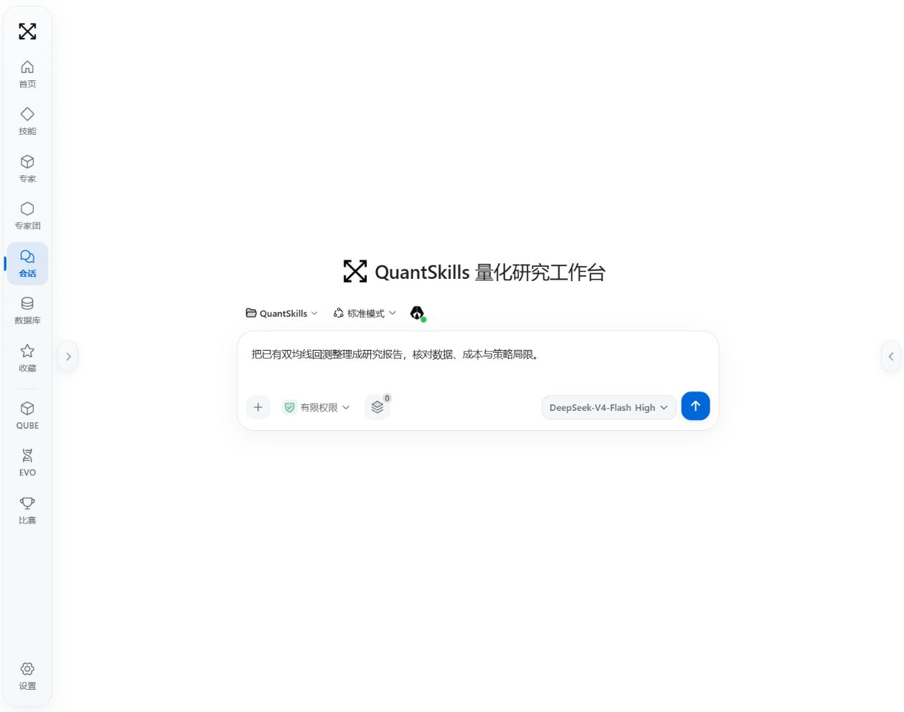
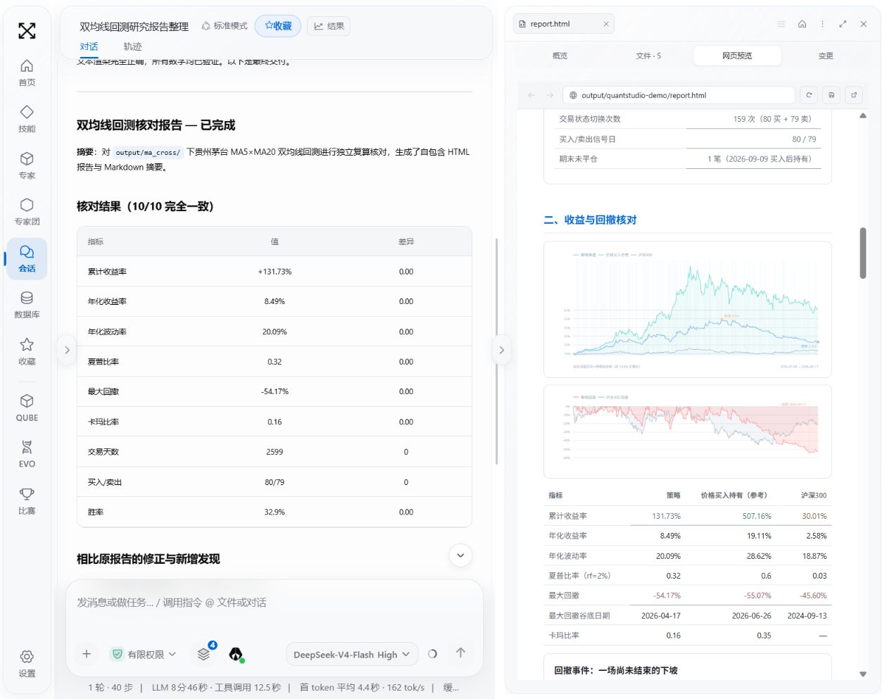
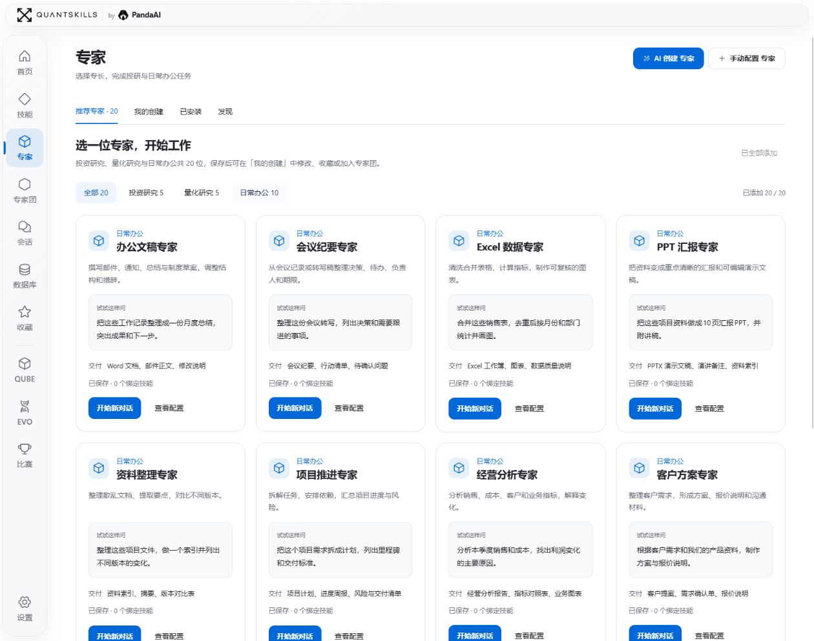
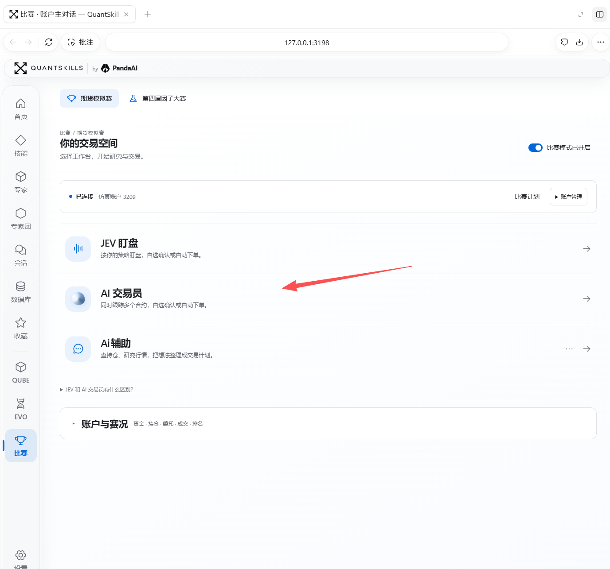
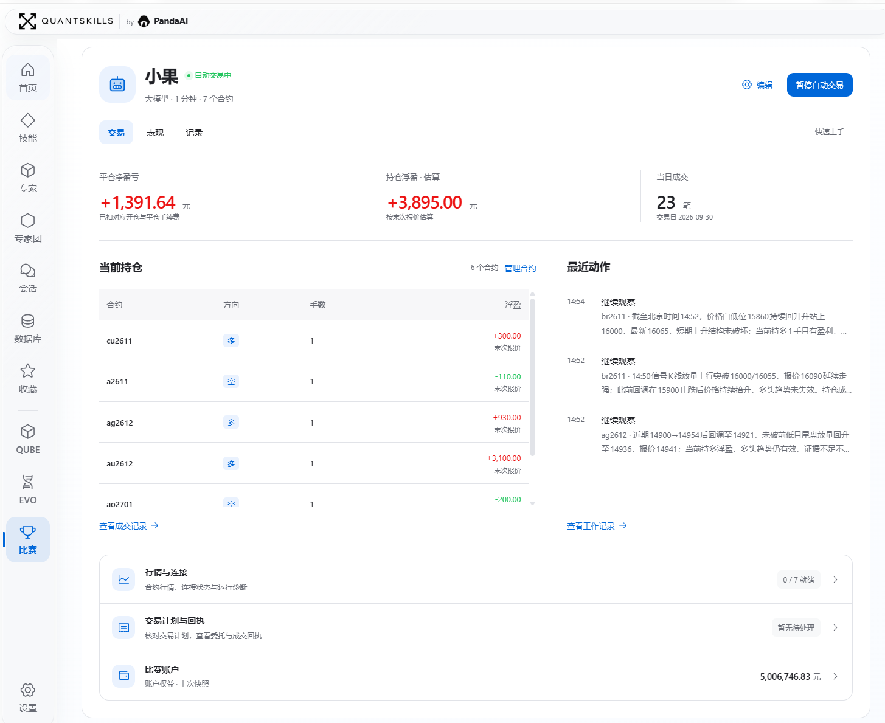
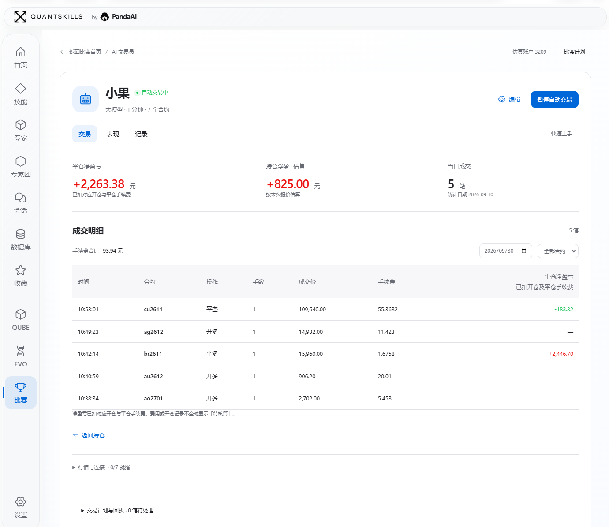

<div align="center">

# QuantStudio

### QUANT × Work × Trade

**Quantitative research, everyday work and trade execution in one open-source workspace.**

From QuantSkills, an open-source community under PandaAI

[Get started](#get-started) · [QUANT](#quant-research) · [Work](#work-everyday-tasks) · [Trade](#trade-research-monitoring-and-execution) · [简体中文](README.md) · [GitHub](https://github.com/quantskills/QuantStudio) · [Gitee](https://gitee.com/quantskills/QuantStudio)



</div>

Review a backtest, clean a spreadsheet, prepare a presentation or connect a futures simulation account. QuantStudio brings these tasks into a workspace with conversations, reusable skills, specialists and teams. Reports, code, files, trade plans and execution receipts can all be opened and checked.

| Area | Example task | Output |
| --- | --- | --- |
| **QUANT** | Review markets, test a factor or audit a strategy backtest. | Reports, data, charts, factor evaluations and inspectable code. |
| **Work** | Combine spreadsheets and turn source materials into a report or presentation. | Workbooks, documents, slide decks and project files. |
| **Trade** | Research a contract, monitor a strategy or manage several trading instruments. | Account data, model decisions, trade plans, fills and closed P&L after fees. |

The workspace runs locally on Windows, macOS and Linux, or as a shared team deployment. Models, data services, Python and document tools are configured as needed. Individual trading integrations have additional platform requirements described below.

## QUANT: research

Use skills and specialists for market reviews, financial statements, factor research, strategy development and backtest checks. For example: **“Turn this moving-average backtest into a report. Check costs, drawdown and out-of-sample performance.”** Open the report beside the conversation to inspect the figures, tables and code.



- **Skills** store reusable methods and steps. Install one or create your own, then load it in a normal workspace conversation.
- **Specialists** combine a role, skills and delivery requirements.
- **Teams** assign responsibilities and coordinate related tasks.

The database area manages local caches, sources and date ranges. The result workbench previews reports and files, including HTML, Markdown and PDF. The online catalog and bundled capability snapshot are separate collections. [Snapshot and import guide](docs/library-snapshot.md)

## Work: everyday tasks

Prepare documents, clean spreadsheets, summarize meeting notes and build presentations. For example: **“Combine these sales sheets, group the results by month and department, then prepare a weekly review.”** Select a specialist or divide the work across a team. Available output formats depend on the configured model, skills and document tools.



Conversations can be continued, archived, restored or deleted. Conversation deletion retains generated files; complete deletion lists eligible files and requires another confirmation. Archived conversations are managed in Settings. [Session and file lifecycle](docs/session-lifecycle.md)

## Trade: research, monitoring and execution

**The competition home provides three separate entries: JEV monitoring, AI Trader and AI Assist. They share the connected competition account.**

The current futures integration uses the PandaAI competition CLI for **simulated futures trading**. Quotes, positions, plans, orders and fills are connected in one workflow. Submission and confirmed execution are tracked separately.



| Workspace | Purpose | Execution |
| --- | --- | --- |
| **JEV monitoring** | TypeSafe Jev evaluates completed bars, quotes, positions and your entry, exit and waiting conditions. Use a template or describe your strategy. | Multiple contracts; per-order confirmation or an authorized automatic run. |
| **AI Trader** | Use a verified QS language model or the neural decision engine to track several contracts and assess target positions. | Plans are previewed and submitted through the competition CLI, with per-order confirmation or automatic execution after authorization. |
| **AI Assist** | Research contracts, inspect positions, review fills and develop a plan through conversation. | Generated plans require user confirmation. |

### Positions and recent decisions

The Trading page opens with closed net P&L, estimated floating P&L and the daily fill count. Current positions and recent actions sit below, with detailed reasoning available in work records.



Search instruments by name, code or exchange and select multiple contracts. Choose a delivery month or enter an actual contract manually. The catalog covers six domestic futures exchanges; availability and tradability depend on the competition counter. Contracts are evaluated separately and share account funds and API quotas.

Describe your requirements in a few sentences. AI Trader reuses verified QS model connections; JEV uses its own configured TypeSafe key. Each workspace provides settings for contracts, instructions, order size and execution mode, with advanced limits available when needed.

### Fills and fees in the Trading page

Choose **View fills** to inspect executions in place. Filter by date and contract, then check action, quantity, fill price, commission and closed net P&L. **Back to positions** returns to the holdings view.

**Closed net P&L = gross closing profit − matched opening commission − closing commission.**

Partial closes allocate opening fees by matched quantity; opening costs are retained across dates. Missing fees or opening evidence produce a pending calculation, never a zero-fee assumption. The fee total also includes opening fees for positions still held, so it must not be subtracted again from net P&L. Floating P&L is an estimate before fees.



These three screenshots show the actual futures simulation interface at specific times. They illustrate features, not future returns.

### First run

1. Configure the model in **Settings → Model services**. JEV needs a TypeSafe key; historical minute bars require PandaData.
2. Connect the simulation account from **Competitions → Futures simulation**, then open JEV or AI Trader.
3. Select actual contracts, enter trading requirements and set order size. AI Trader needs its Python controller; the neural engine additionally requires its dedicated Python environment and MaleCNS. Blender is not required.
4. Select per-order confirmation or automatic execution. An automatic run starts only after reviewing and authorizing its account, contract scope, limits and risks.
5. Follow execution receipts. Missing market data, model timeouts and API limits are reported; a decision is not an order, and a submitted order is not a confirmed fill.

Pausing stops subsequent new orders; **it does not cancel submitted orders or close positions**. JEV and AI Trader do not submit strategy plans for the same account at the same time. Shared competition quotas are 60 read requests and 10 trading requests per minute. Rate-limit retries respect the server and wait at least 30 seconds.

JEV futures CLI integration currently supports local Windows and macOS use. AI Trader's initial environment setup primarily targets Windows. [Futures and JEV guide](docs/contest.md) · [Multiple JEV contracts](docs/jev-multiple-contracts.md) · [AI Trader guide](docs/fly-integration.md)

The competition area also includes **factor research**: agree on a batch and budget, inspect backtests, compare candidates, manage a factor pool and confirm submission. A compute stop threshold is not a hard platform spending cap. [Factor competition guide](docs/factor-contest.md)

## Get started

Install **Git** and **Node.js 22.x starting at 22.19, or Node.js 24+**. The project pins pnpm 11.7.0.

```sh
git clone -c core.longpaths=true https://github.com/quantskills/QuantStudio.git
cd QuantStudio
corepack enable
pnpm install --frozen-lockfile
pnpm run web
```

You can use the Gitee mirror instead:

```sh
git clone -c core.longpaths=true https://gitee.com/quantskills/QuantStudio.git
```

Open the URL printed in the terminal, such as `http://127.0.0.1:3198/`. Configure a model in Settings and start a conversation. Tasks using existing materials do not require a market-data connection.

New installations store configuration and credentials in `~/.dsh-quantstudio` and use a dedicated `quantstudio` profile, leaving the ordinary DSH `web` profile unchanged. A recognized older QuantStudio launcher keeps using its existing `~/.dsh` data directory, preserving sessions and model settings; its original `web` profile is retained.

Override the data directory with `DSH_HOME` and the profile name with `QUANTSKILLS_PROFILE`. Plugin installation calls the project's pinned pnpm 11.7.0 directly, prepares a staging profile, and switches only after installation succeeds. Previous profiles are backed up under `profiles/.qs-backups/` in the data directory. Failed startup restores the previous profile. Start with `pnpm run web` to use these checks and recovery.

Select your workspace in Settings. Stop the local service with `Ctrl+C`, then run the startup command again to continue. On Windows, prefer a short installation path to avoid system path-length limits. OS metadata files (`.DS_Store`, `Thumbs.db`, `desktop.ini`) no longer block managed installation or updates. Actual source changes still select development mode; the terminal reports the source directory used.

Local conversations, configuration and files remain on your computer; configured model and data services use the network. Shared deployments can share workspaces and files, but **do not isolate data between members**.

## Updates and development

Choose GitHub or Gitee as the application update source. Official releases are validated in a separate directory and switched on a normal restart. Updates preserve personal capabilities, conversations, credentials, caches and work products. Syncing `main` alone does not trigger installation of an official release. [Publishing and mirrors](docs/publishing.md)

```sh
pnpm run check
pnpm run test
pnpm run test:update
pnpm run ci:smoke
```

Source lives in `src/` and `packages/`; each package contains its distributed `lib/` output. Capability snapshots live in `assets/library-v2/`. [Runtime baseline](SOURCE_BASELINE.md) · [Release notes](RELEASE_NOTES.md)

QuantStudio is dual-licensed under [GPL-3.0-or-later](LICENSE) and the [PandaAI commercial license](COMMERCIAL-LICENSE.md). Third-party components retain their licenses; see [third-party notices](THIRD_PARTY_NOTICES.md) and `LICENSES/`.

<div align="center">

**QuantStudio · QUANT × Work × Trade · by PandaAI**

[QuantSkills](https://www.quantskills.ai/) · [PandaAI](https://www.pandaaiquant.com/) · [GitHub](https://github.com/quantskills/QuantStudio) · [Gitee](https://gitee.com/quantskills/QuantStudio)

</div>
