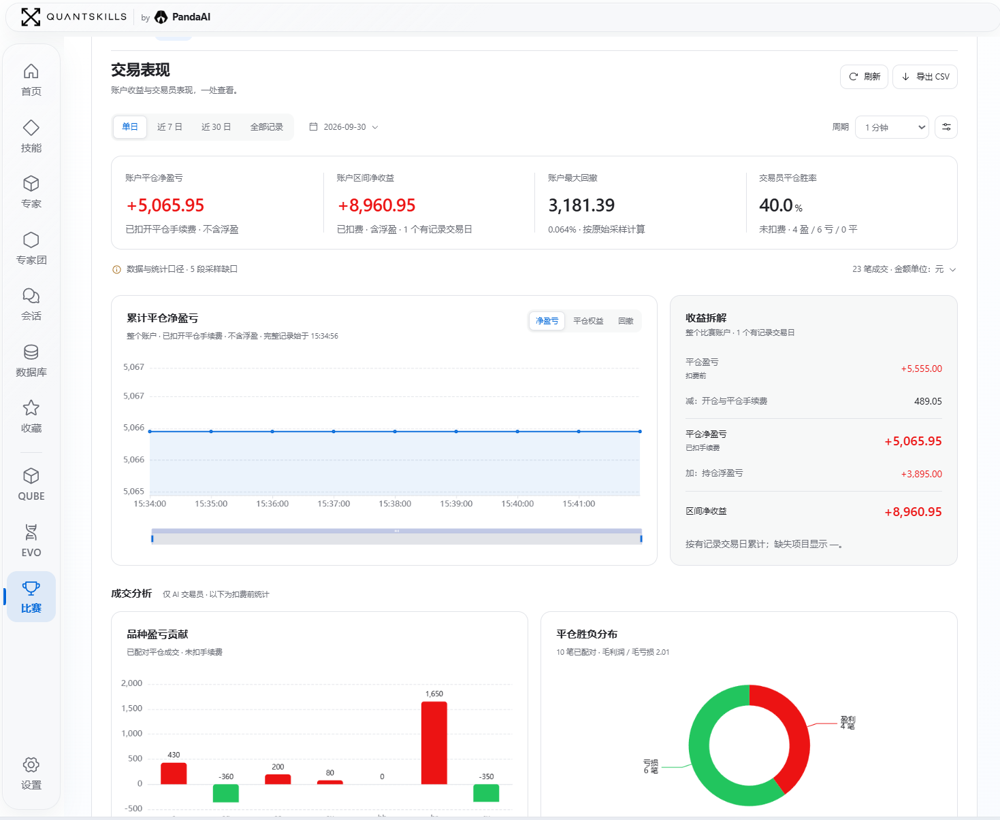

<div align="center">

# QuantStudio

### QUANT × Work × Trade

**Quantitative research, everyday work and trade execution in one open-source workspace.**

From QuantSkills, an open-source community under PandaAI

[Agent setup](#agent-install) · [Manual setup](#get-started) · [QUANT](#quant-research) · [Work](#work-everyday-tasks) · [Trade](#trade-research-monitoring-and-execution) · [简体中文](README.md) · [GitHub](https://github.com/quantskills/QuantStudio) · [Gitee](https://gitee.com/quantskills/QuantStudio)

</div>

<a id="agent-install"></a>

## Install with a local agent: complete macOS / Windows prompts

Copy the appropriate prompt into an agent **with terminal and file access on the target computer**. It will check prerequisites, install dependencies, run checks and start the app, explaining any system authorization or manual steps it needs. Each prompt includes the repository URLs and can be copied on its own.

<details>
<summary><strong>macOS: expand and copy the complete installation prompt</strong></summary>

```text
Install, verify and start QuantStudio on this Mac. Leave a working local service running when finished.
Official repository: https://github.com/quantskills/QuantStudio.git
Mirror: https://gitee.com/quantskills/QuantStudio.git

1. Inspect the system and tools.
   Identify Apple Silicon or Intel and record macOS, Git, Node.js, npm and Corepack versions and paths.
   Read README.md, engines/packageManager in package.json, and the installation scripts.
   Current requirements are Node.js 22.19+ in the 22.x line or 24+, and pnpm 11.7.0.
   Install missing tools through official installers or an existing package manager, matching the architecture.
   Preserve runtimes used by other projects.
   Explain any required system authorization.

2. Prepare the source in a writable directory such as ~/QuantStudio.
   Run git clone -c core.longpaths=true --branch main https://github.com/quantskills/QuantStudio.git.
   Use the Gitee mirror if GitHub is unreachable and report that choice.
   If the directory exists, inspect its remote, branch and git status; update only a clean checkout that can fast-forward.
   Otherwise preserve it and choose a new directory without force-resetting or cleaning files.

3. Pin the package manager.
   In the repository, run corepack enable and corepack pnpm --version.
   Verify the version matches package.json (currently 11.7.0).
   If Corepack is missing or reports an outdated entry point/signature error, follow https://github.com/nodejs/corepack to install or update it, then retry.
   Do not switch to pnpm@latest or change packageManager/the lockfile to bypass errors.
   Do not run an unpinned pnpm installation outside the repository.

4. Run corepack pnpm install --frozen-lockfile from the repository root.
   Check the exit code.
   Diagnose network, Node, permissions or dependency errors before continuing; retain the lockfile and do not report a failed installation as complete.

5. Run corepack pnpm run check, corepack pnpm run test, and corepack pnpm run test:update in sequence.
   Report each result.
   Investigate failures instead of skipping or weakening checks.
   Keep installation logs and scratch files outside the repository so untracked files do not cause first launch to select development mode.

6. Preserve existing data.
   Let the app resolve its data directory: a new installation defaults to ~/.dsh-quantstudio with the quantstudio profile; a recognized older QuantStudio installation may retain ~/.dsh.
   Inspect and report existing DSH_HOME/QUANTSKILLS_PROFILE overrides before changing them.
   Do not delete sessions, keys or plugins, or manually rewrite ordinary DSH's web profile.

7. Start from the repository using corepack pnpm run web through the normal launcher.
   Do not bypass installation by invoking dsh directly.
   Inspect existing services and occupied ports; do not terminate unrelated processes.
   Select an available port if needed and record it.
   Use a persistent terminal or managed background process, keeping logs and a documented stop procedure.

8. Verify the address actually printed in the startup log rather than assuming a port.
   Check HTTP, then open the QuantStudio home and Settings in a browser and check for startup errors.
   Without browser access, explicitly report HTTP-only verification and give manual UI checks.
   If it runs from a development checkout, report that rather than claiming managed installation.
   Resolve actual filesystem paths when troubleshooting /tmp versus /private/tmp.

9. Report the source directory, commit, actual runtime directory, DSH_HOME, profile, Node/pnpm versions, check results, URL, logs, and commands to stop and start next time.
   Leave the service running.
   I will enter model keys in Settings → Model services; do not expose credentials in logs or replies.
   Do not connect trading accounts or start trading as part of installation.
   A working macOS workspace does not establish that every trading runtime is supported or prepared; report module-specific requirements separately.
```

</details>

<details>
<summary><strong>Windows: expand and copy the complete installation prompt</strong></summary>

```text
Use PowerShell to install, verify and start QuantStudio on this Windows computer. Leave a working local service running when finished.
Official repository: https://github.com/quantskills/QuantStudio.git
Mirror: https://gitee.com/quantskills/QuantStudio.git

1. Inspect Windows version, x64/ARM64 architecture, and Git, Node.js, npm and Corepack versions and paths.
   Use Get-Command/where.exe to detect competing PATH entries.
   Read README.md, engines/packageManager in package.json, and installation scripts.
   Current requirements are Node.js 22.19+ in the 22.x line or 24+, and pnpm 11.7.0.
   Install missing tools through official installers or an existing package manager, refresh the process PATH and verify again.
   Do not require the whole app to run as administrator by default.

2. Choose a short writable source path, for example C:\QuantStudio; use another suitable location if it is occupied or not writable.
   Avoid OneDrive and deeply nested directories.
   Run git clone -c core.longpaths=true --branch main https://github.com/quantskills/QuantStudio.git <chosen-directory>.
   Use Gitee if GitHub is unreachable and report that choice.
   Inspect an existing directory's remote, branch and git status before using it.
   Only update a clean checkout that can fast-forward; otherwise preserve it and choose a new directory without force-resetting or cleaning files.

3. Pin the package manager.
   In the repository root run corepack.cmd enable and corepack.cmd pnpm --version.
   Verify the package.json version (currently 11.7.0).
   Use .cmd entry points to avoid PowerShell .ps1 execution-policy conflicts.
   If Corepack is missing, outdated or conflicts with the Node Windows installer, follow the Windows instructions at https://github.com/nodejs/corepack.
   Explain any required administrator step without disabling system security policy.
   Do not switch to pnpm@latest or change packageManager/the lockfile to bypass errors.

4. Run corepack.cmd pnpm install --frozen-lockfile.
   Check $LASTEXITCODE after each external command and stop dependent steps on failure.
   Prefer a shorter path for path-length failures and diagnose connectivity before changing network settings.
   Retain the lockfile and fixed dependency versions.

5. Run corepack.cmd pnpm run check, corepack.cmd pnpm run test, and corepack.cmd pnpm run test:update in sequence, recording each exit code and result.
   Diagnose failures rather than skipping or weakening checks.
   Store logs and scratch files outside the repository so they do not cause first launch to select development mode.

6. Preserve existing data.
   New installations default to %USERPROFILE%\.dsh-quantstudio and the quantstudio profile; a recognized older QuantStudio installation may retain %USERPROFILE%\.dsh.
   Inspect DSH_HOME/QUANTSKILLS_PROFILE before changing them.
   Do not remove existing sessions, keys or plugins, or manually rewrite ordinary DSH's web profile.
   Record source and data directories separately.

7. Run corepack.cmd pnpm run web through the normal launcher.
   Do not invoke dsh directly to bypass preparation.
   Inspect existing services and ports without terminating unrelated processes.
   If changing the port, check the supported launcher arguments first.
   Prefer a persistent terminal; when using Start-Process for a background service, include -WindowStyle Hidden, handle paths containing spaces correctly, retain logs and record the PID and stop procedure.

8. Use the URL printed in the startup log, not a hard-coded port such as 3198.
   Check HTTP with Invoke-WebRequest, then verify the QuantStudio home and Settings in a browser and inspect startup errors.
   Without browser access, report HTTP-only verification and provide manual UI checks.
   Confirm the actual runtime directory and distinguish a development checkout from managed installation.
   If a desktop shortcut was created, inspect its target rather than assuming it works.

9. Report source directory, commit, actual runtime directory, DSH_HOME, profile, Node/pnpm versions, check results, URL, logs, PID, and commands to stop and start next time.
   Leave the service running.
   I will enter model keys in Settings → Model services; do not expose credentials in logs or replies.
   Do not connect trading accounts or start trading as part of installation.
   Prepare AI Trader's Python environment separately through its UI when needed; the base workspace does not require Blender.
```

</details>


Review a backtest, clean a spreadsheet, prepare a presentation or connect a futures simulation account. QuantStudio brings these tasks into a workspace with conversations, reusable skills, specialists and teams. Reports, code, files, trade plans and execution receipts can all be opened and checked.

| Area | Example task | Output |
| --- | --- | --- |
| **QUANT** | Review markets, test a factor or audit a strategy backtest. | Reports, data, charts, factor evaluations and inspectable code. |
| **Work** | Combine spreadsheets and turn source materials into a report or presentation. | Workbooks, documents, slide decks and project files. |
| **Trade** | Research a contract, monitor a strategy or manage several trading instruments. | Account data, model decisions, trade plans, fills and closed P&L after fees. |

The workspace runs locally on Windows, macOS and Linux, or as a shared team deployment. Models, data services, Python and document tools are configured as needed. Individual trading integrations have additional platform requirements described below.

## QUANT: research

Use skills and specialists for market reviews, financial statements, factor research, strategy development and backtest checks. For example: **“Turn this moving-average backtest into a report. Check costs, drawdown and out-of-sample performance.”** Open the report beside the conversation to inspect the figures, tables and code.


- **Skills** store reusable methods and steps. Install one or create your own, then load it in a normal workspace conversation.
- **Specialists** combine a role, skills and delivery requirements.
- **Teams** assign responsibilities and coordinate related tasks.

The database area manages local caches, sources and date ranges. The result workbench previews reports and files, including HTML, Markdown and PDF. The online catalog and bundled capability snapshot are separate collections. [Snapshot and import guide](docs/library-snapshot.md)

## Work: everyday tasks

Prepare documents, clean spreadsheets, summarize meeting notes and build presentations. For example: **“Combine these sales sheets, group the results by month and department, then prepare a weekly review.”** Select a specialist or divide the work across a team. Available output formats depend on the configured model, skills and document tools.


Conversations can be continued, archived, restored or deleted. Conversation deletion retains generated files; complete deletion lists eligible files and requires another confirmation. Archived conversations are managed in Settings. [Session and file lifecycle](docs/session-lifecycle.md)

## Trade: research, monitoring and execution

**The competition home provides three separate entries: JEV monitoring, AI Trader and AI Assist. They share the connected competition account.**

The current futures integration uses the PandaAI competition CLI for **simulated futures trading**. Quotes, positions, plans, orders and fills are connected in one workflow. Submission and confirmed execution are tracked separately.


| Workspace | Purpose | Execution |
| --- | --- | --- |
| **JEV monitoring** | TypeSafe Jev evaluates completed bars, quotes, positions and your entry, exit and waiting conditions. Use a template or describe your strategy. | Multiple contracts; per-order confirmation or an authorized automatic run. |
| **AI Trader** | Use a verified QS language model or the neural decision engine to track several contracts and assess target positions. | Plans are previewed and submitted through the competition CLI, with per-order confirmation or automatic execution after authorization. |
| **AI Assist** | Research contracts, inspect positions, review fills and develop a plan through conversation. | Generated plans require user confirmation. |

### Positions and recent decisions

The Trading page opens with closed net P&L, estimated floating P&L and the daily fill count. Current positions and recent actions sit below. Expand the market connection, trade plans and account sections when needed.


Search instruments by name, code or exchange and select multiple contracts. Choose a delivery month or enter an actual contract manually. The catalog covers six domestic futures exchanges; availability and tradability depend on the competition counter. Contracts are evaluated separately and share account funds and API quotas.

Describe your requirements in a few sentences. AI Trader reuses verified QS model connections; JEV uses its own configured TypeSafe key. Each workspace provides settings for contracts, instructions, order size and execution mode, with advanced limits available when needed.

### Fills and fees in the Trading page

Choose **View fills** to inspect executions in place. Filter by date and contract, then check action, quantity, fill price, commission and closed net P&L. **Back to positions** returns to the holdings view.

**Closed net P&L = gross closing profit − matched opening commission − closing commission.**

Partial closes allocate opening fees by matched quantity; opening costs are retained across dates. Missing fees or opening evidence produce a pending calculation, never a zero-fee assumption. The fee total also includes opening fees for positions still held, so it must not be subtracted again from net P&L. Floating P&L is an estimate before fees.


### Performance: returns, fees and their sources

The Performance page supports a single day, the past 7 or 30 days, and custom dates. Change the sampling period, inspect data gaps or export CSV. Account net closing P&L, range net return, maximum drawdown and the trader's closing win rate sit above the P&L curve, return breakdown, product contributions and win/loss distribution.



**Check the scope before comparing numbers.** Account returns on the Performance page cover the whole competition account; closed net P&L on the Trading page uses AI Trader's matched fills. They cover different scopes. The breakdown lists opening and closing fees separately, while gross metrics such as product contributions and closing win rate are labeled before fees. Missing values remain unknown instead of becoming zero.

The Records page shows **20 entries per page**, with source filters, selected deletion and delete all. Deletion requires confirmation and clears the displayed journal while retaining execution receipts, P&L records and strategy audit evidence.

Screenshots in this section show the actual futures simulation interface at different times. They illustrate features, not future returns.

### First run

1. Configure the model in **Settings → Model services**. JEV needs a TypeSafe key; historical minute bars require PandaData.
2. Connect the simulation account from **Competitions → Futures simulation**, then open JEV or AI Trader.
3. Select actual contracts, enter trading requirements and set order size. AI Trader needs its Python controller; the neural engine additionally requires its dedicated Python environment and MaleCNS. Blender is not required.
4. Select per-order confirmation or automatic execution. An automatic run starts only after reviewing and authorizing its account, contract scope, limits and risks.
5. Follow execution receipts. Missing market data, model timeouts and API limits are reported; a decision is not an order, and a submitted order is not a confirmed fill.

Pausing stops subsequent new orders; **it does not cancel submitted orders or close positions**. JEV and AI Trader do not submit strategy plans for the same account at the same time. Shared competition quotas are 60 read requests and 10 trading requests per minute. Rate-limit retries respect the server and wait at least 30 seconds.

JEV futures CLI integration currently supports local Windows and macOS use. AI Trader's initial environment setup primarily targets Windows. [Futures and JEV guide](docs/contest.md) · [Multiple JEV contracts](docs/jev-multiple-contracts.md) · [AI Trader guide](docs/fly-integration.md)

The competition area also includes **factor research**: agree on a batch and budget, inspect backtests, compare candidates, manage a factor pool and confirm submission. A compute stop threshold is not a hard platform spending cap. [Factor competition guide](docs/factor-contest.md)

## Get started

Install **Git** and **Node.js 22.x starting at 22.19, or Node.js 24+**. The project pins pnpm 11.7.0.

```sh
git clone -c core.longpaths=true https://github.com/quantskills/QuantStudio.git
cd QuantStudio
corepack enable
corepack pnpm install --frozen-lockfile
corepack pnpm run web
```

You can use the Gitee mirror instead:

```sh
git clone -c core.longpaths=true https://gitee.com/quantskills/QuantStudio.git
```

**Corepack problems?** First verify the pinned pnpm version inside the repository. See the [official Corepack instructions](https://github.com/nodejs/corepack#how-to-install) for installation, updates and Windows installer conflicts. This project uses pnpm 11.7.0 rather than whichever major version the [general installation page](https://pnpm.io/installation) currently defaults to. In PowerShell, use `corepack.cmd` in place of `corepack` in the manual commands above.

Open the URL printed in the terminal, such as `http://127.0.0.1:3198/`. Configure a model in Settings and start a conversation. Tasks using existing materials do not require a market-data connection.

New installations store configuration and credentials in `~/.dsh-quantstudio` and use a dedicated `quantstudio` profile, leaving the ordinary DSH `web` profile unchanged. A recognized older QuantStudio launcher keeps using its existing `~/.dsh` data directory, preserving sessions and model settings; its original `web` profile is retained.

Override the data directory with `DSH_HOME` and the profile name with `QUANTSKILLS_PROFILE`. Plugin installation calls the project's pinned pnpm 11.7.0 directly, prepares a staging profile, and switches only after installation succeeds. Previous profiles are backed up under `profiles/.qs-backups/` in the data directory. Failed startup restores the previous profile. Start with `corepack pnpm run web` to use these checks and recovery.

Select your workspace in Settings. Stop the local service with `Ctrl+C`, then run the startup command again to continue. On Windows, prefer a short installation path to avoid system path-length limits. OS metadata files (`.DS_Store`, `Thumbs.db`, `desktop.ini`) no longer block managed installation or updates. Actual source changes still select development mode; the terminal reports the source directory used.

Local conversations, configuration and files remain on your computer; configured model and data services use the network. Shared deployments can share workspaces and files, but **do not isolate data between members**.

## Updates and development

Choose GitHub or Gitee as the application update source. Official releases are validated in a separate directory and switched on a normal restart. Updates preserve personal capabilities, conversations, credentials, caches and work products. Syncing `main` alone does not trigger installation of an official release. [Publishing and mirrors](docs/publishing.md)

```sh
corepack pnpm run check
corepack pnpm run test
corepack pnpm run test:update
corepack pnpm run ci:smoke
```

Source lives in `src/` and `packages/`; each package contains its distributed `lib/` output. Capability snapshots live in `assets/library-v2/`. [Runtime baseline](SOURCE_BASELINE.md) · [Release notes](RELEASE_NOTES.md)

QuantStudio is dual-licensed under [GPL-3.0-or-later](LICENSE) and the [PandaAI commercial license](COMMERCIAL-LICENSE.md). Third-party components retain their licenses; see [third-party notices](THIRD_PARTY_NOTICES.md) and `LICENSES/`.

<div align="center">

**QuantStudio · QUANT × Work × Trade · by PandaAI**

[QuantSkills](https://www.quantskills.ai/) · [PandaAI](https://www.pandaaiquant.com/) · [GitHub](https://github.com/quantskills/QuantStudio) · [Gitee](https://gitee.com/quantskills/QuantStudio)

</div>
