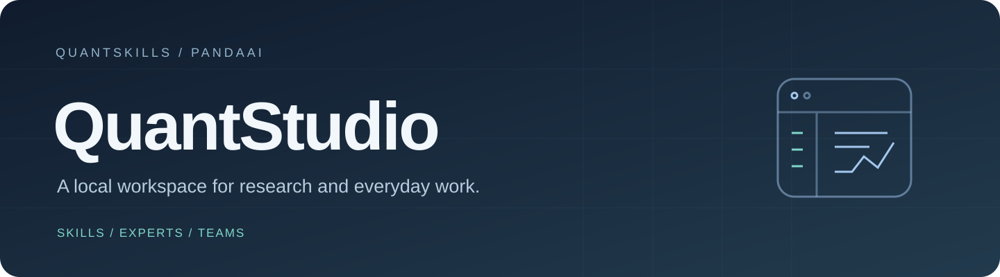
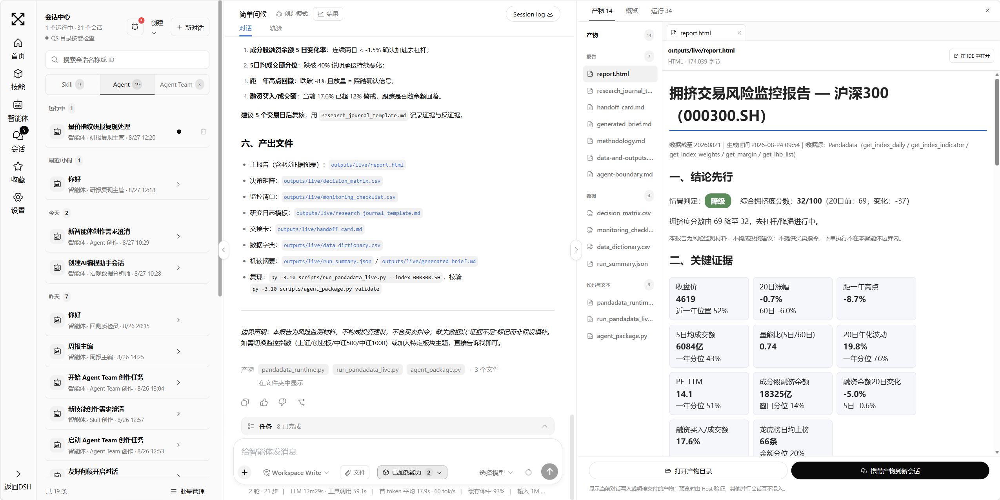

<b>把技能、专家、数据和成果，放进同一个工作空间。</b>

<a href="README.en.md">English</a> · <a href="#开始使用">开始使用</a> · <a href="#技能专家与专家团">能力库</a> · <a href="RELEASE_NOTES.md">更新说明</a>

<a href="https://github.com/quantskills/QuantStudio">GitHub</a> · <a href="https://gitee.com/quantskills/QuantStudio">Gitee 国内镜像</a> · <a href="https://github.com/songshuquant/QuantStudio">songshuquant 同步仓库</a>

## 这是 QuantStudio

QuantStudio 是 QuantSkills / PandaAI 的本地 AI 工作台，面向量化研究与日常办公。用自然语言发起任务，调用可复用的技能，交给专家或专家团协作，再在同一页面查看报告、图表、代码与数据。

应用集成固定版本的 DSH 运行时、独立界面和启动器。安装项目依赖即可运行，无需另行安装或拼装 DSH。会话、个人能力库和工作文件保存在本机；模型调用及外部数据服务按你的配置联网。

## 从任务到交付

| 你要做的事 | 在 QuantStudio 中如何完成 |
| --- | --- |
| 验证一个策略或因子 | 选择量化专家，说明标的、日期和规则，检查数据、回测结果与复现代码。 |
| 研究公司、行业或新闻事件 | 由相关专家分工收集、分析与交叉检查，汇总为带依据的报告。 |
| 整理资料、表格与汇报 | 上传文件，调用办公专家，输出可继续编辑的文档、表格或演示材料。 |
| 复用一套成熟流程 | 保存为技能；将角色、技能与模型配置组合成专家；让多位专家组成专家团。 |
| 持续使用研究数据 | 数据库按行情、新闻、基本面及其他分类管理本地缓存，支持预览、更新、删除与清空。 |

数据库优先检查本地缓存。过期、覆盖日期或条数不足时再按需获取；PandaData 与外部数据的使用取决于已配置的数据源和权限。

## 技能、专家与专家团

**技能**定义可重复执行的方法；**专家**将角色与技能组合起来；**专家团**围绕一个目标安排负责人和成员。三者均有独立入口，也可以从会话输入框按“我创建的、推荐的、已安装、发现的”等来源选择。

本仓库包含经过校验的可迁移能力快照：**15 个技能、44 个专家定义、14 个专家团**。专家数量包含创作助手。快照中保留技能版本、依赖关系与自建内容，不包含模型密钥或会话历史。

- 量化与投研：策略回测、因子评估、公司与行业研究、新闻分析等。
- 日常办公：资料整理、文档、表格、汇报与协作任务等。
- 自主扩展：手动创建或通过对话生成草案，确认后保存。

快照不是强制安装清单，更新应用不会用它覆盖你的能力库。[查看快照与导入方式](docs/library-snapshot.md)。

## 一套完整的工作界面

- **对话与成果并排查看**：预览 Markdown、HTML、PDF、数据表和代码；图片双击放大、滚轮缩放。
- **完整主题适配**：默认“极简·雾蓝”，并提供其他深色、浅蓝玻璃、雨季、水墨等主题。按钮、文字、图标、面板与生成产物的主题提示同步变化。
- **互动背景**：流体、粒子和涟漪；支持暂停动效及系统减少动态效果偏好。
- **移动端布局**：窄屏下切换导航与侧栏，让会话内容保留可读宽度。
- **模型配置**：首次启动未配置模型时引导设置；模型与数据源凭据由用户在本机管理。

## 开始使用

需要 Git，以及 Node.js **22.19 或以上的 22.x 版本，或 24 及以上版本**。项目固定 pnpm 11.7.0 与 DSH 0.1.2-alpha.2；已提交可运行的构建产物。

~~~sh
git clone -c core.longpaths=true https://github.com/quantskills/QuantStudio.git
cd QuantStudio
corepack enable
pnpm install --frozen-lockfile
pnpm run web
~~~

国内网络可把克隆命令替换为：

~~~sh
git clone -c core.longpaths=true https://gitee.com/quantskills/QuantStudio.git
~~~

启动后访问 [http://127.0.0.1:3198/](http://127.0.0.1:3198/)。本机浏览器无需复制 Token；远程或代理请求仍受来源与认证检查。首次打开后配置模型，再选择专家或新建会话。

Python 和数据服务按任务需要单独配置。应用不会因尚未安装 Python 或尚未登录 PandaData 而阻止普通对话。所有命令都在项目根目录执行。

## 更新应用，保留自己的内容

首页自动检查所选 GitHub / Gitee 来源中的正式版本，也可手动检查。**有更新时按钮变色，展示版本号和更新内容**。下载与安装需要你点击确认。

| 会更新 | 保持原样 |
| --- | --- |
| 应用代码、界面、运行包与内置推荐模板 | 自建及已安装技能、专家、专家团 |
| 正式版本附带的静态资源 | 会话历史、数据库缓存、模型配置与凭据 |
| 已验证的版本依赖 | 工作区文件与生成产物 |

候选版本在独立目录下载，经过依赖安装、类型检查和启动测试后，等待下次正常启动切换；启动失败会回滚。只发布到 main 而未创建正式版本标签的提交不会触发安装。

**从旧仓库迁移**：QuantStudio 使用独立 Git 历史。请克隆到新目录，保留原 DSH_HOME 与工作区；不要在旧开发目录强制拉取或重置。自定义分支、本地修改和分叉历史会受到更新保护。能力快照仅在明确导入时写入空能力库。

## PandaAI 产品入口

| 产品 | 适合的工作 | 入口 |
| --- | --- | --- |
| QUBE | 用自然语言构建策略、运行回测与快速验证想法 | [开始体验 QUBE](https://www.pandaaiquant.com/agent_quant/) |
| EVO | 因子、策略与研究环境中的持续研究和协作 | [开始体验 EVO](https://www.pandaaiquant.com/evo/) |

应用内提供产品介绍与真实界面展示，点击“开始体验”后进入对应服务。

## 开发与验证

~~~sh
pnpm run check
pnpm run test
pnpm run test:update
pnpm run ci:smoke
~~~

正式发布后验证两个远端与真实更新流程：

~~~sh
pnpm run verify:update-mirrors
pnpm run verify:update-live github
pnpm run verify:update-live gitee
~~~

真实更新验证使用临时目录，覆盖匿名访问、下载、安装、启动切换和个人数据保持。源码位于 src/ 和 packages/，构建产物位于 lib/，能力快照位于 assets/library-v2/。[运行时基线](SOURCE_BASELINE.md) · [发布与镜像说明](docs/publishing.md)。

## 许可证

QuantStudio 使用 [GPL-3.0-or-later](LICENSE) / [PandaAI 商业授权](COMMERCIAL-LICENSE.md) 双授权。集成的 DSH 及其他第三方组件遵循各自许可证；相关版权与许可证保留在 [第三方声明](THIRD_PARTY_NOTICES.md) 和 LICENSES/ 中。

本仓库以独立历史发布，由 QuantSkills 维护。第三方组件的来源和授权声明不因仓库历史重建而改变。
