<div align="center">

# QuantStudio

### 让研究想法，走到真实交付。

QuantSkills 量化研究工作台 · by PandaAI

[开始使用](#开始使用) · [English](README.en.md) · [GitHub](https://github.com/quantskills/QuantStudio) · [Gitee](https://gitee.com/quantskills/QuantStudio)

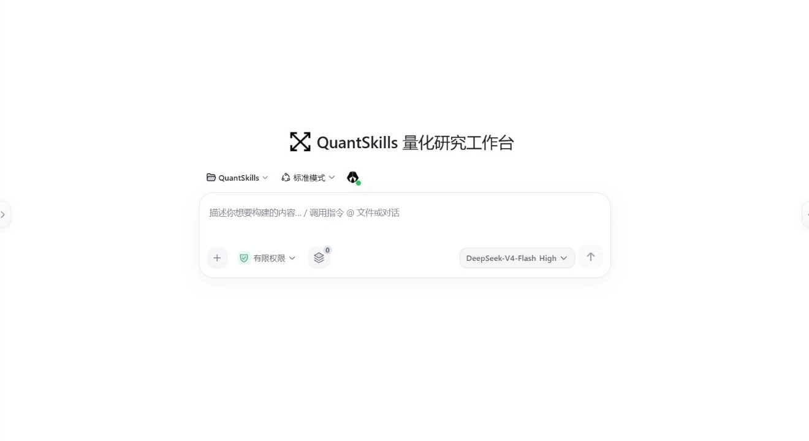

</div>

**说出目标，选择能力，在对话里推进任务，打开真正生成的报告、图表、代码和文件。**

QuantStudio 是 QuantSkills / PandaAI 的 AI 工作台。它把技能、专家、专家团、会话、数据和产物放在同一个研究空间中，覆盖量化研究、投资分析与日常办公。支持本地运行，也可部署为团队共享工作区。

## 从一句需求，到一份可检查的成果

> 帮我把已有的双均线回测，整理成一份清晰的研究报告。

1. **描述任务**：明确目标、已有资料与交付格式。
2. **选择能力**：加载技能，选择专家，或组织专家团分工。
3. **推进研究**：在对话与轨迹中查看步骤、工具调用和执行情况。
4. **检查成果**：在结果工作台打开报告、图表、数据与代码，继续核对或下载。

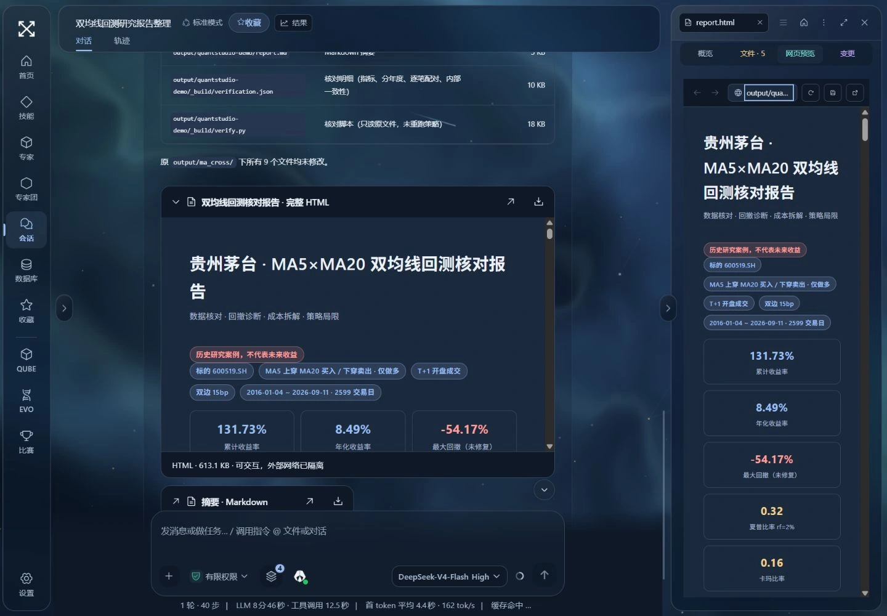

本次演示实际读取已有回测文件，复算指标，并生成 HTML 报告及 Markdown 摘要。报告图表属于历史研究案例，不代表未来收益。视频中的等待过程经过剪辑。

## 一张工作台，完成整项任务

| 栏目 | 你可以做什么 |
| --- | --- |
| **首页** | 描述需求、发现公开能力、继续最近的工作。 |
| **技能** | 发现、安装、创建和复用研究方法与操作流程。 |
| **专家** | 选择研究或办公角色，配置职责与技能，独立开始对话。 |
| **专家团** | 查看负责人、成员、分工和交付要求，组织协作任务。 |
| **会话** | 在对话与轨迹中推进工作；右侧集中查看文件和研究产物。 |
| **数据库** | 搜索、预览和管理本地数据缓存，检查来源与时效。 |
| **收藏** | 保留常用能力和入口，继续已有工作或开始新任务。 |
| **比赛** | 按需开启期货模拟赛或第四届因子大赛，使用专用研究会话。 |
| **QUBE / EVO** | 查看产品介绍，进入 PandaAI 对应的独立服务。 |
| **设置** | 管理工作区、模型、权限、插件、数据连接、外观与更新。 |

### 技能：把好方法留下来

数据接口、因子研发、市场分析、风险监控、策略回测、研究验证……按任务发现和安装技能，也可以创建自己的方法。输入框里的能力面板用于管理当前会话加载的内容。

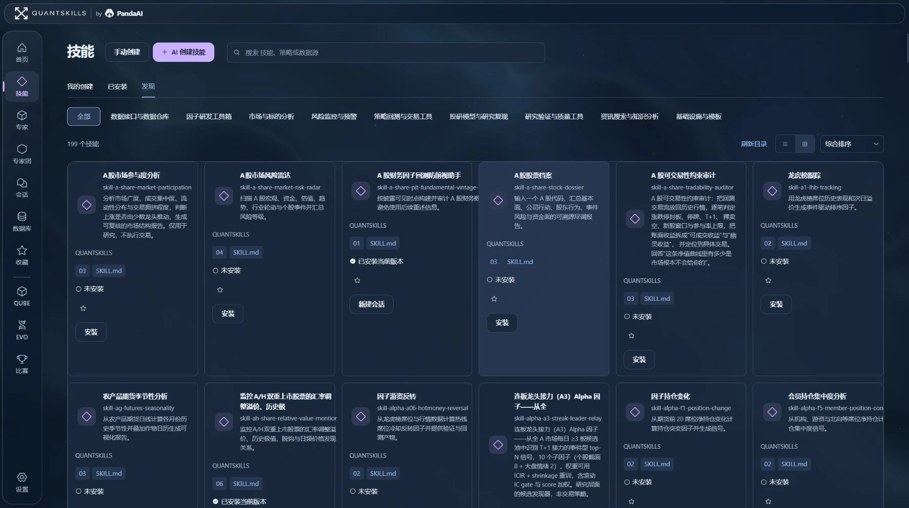

### 专家：选专长，开始工作

个股研究、财报解读、行业分析、策略回测、因子挖掘，以及 Excel、会议纪要、办公文稿与 PPT。每位专家都有明确职责，可以配置技能，并保留自己的会话。

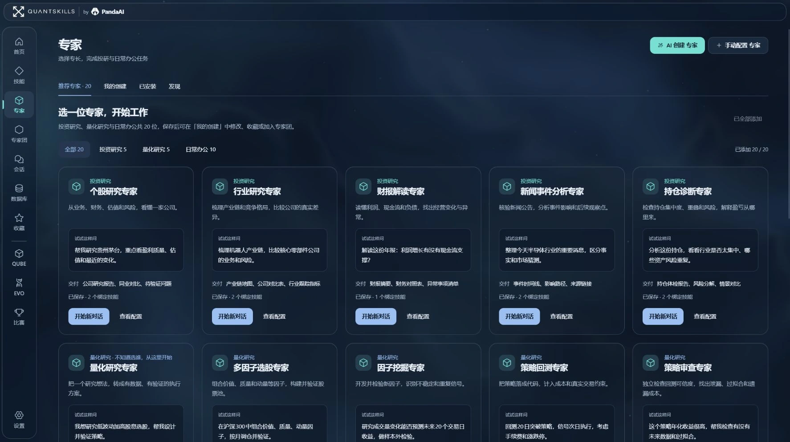

### 专家团：先分工，再协作

公司深度研究、每日市场研究、多因子选股、量化策略研发，以及周报月报、客户提案、项目交付等团队，提供负责人、成员和工作流程。也可以描述目标，让 AI 创建团队草案，确认后保存。

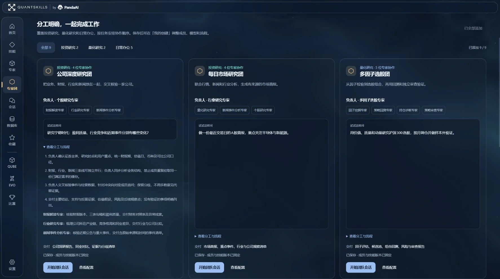

仓库附带可迁移能力快照：**15 个技能、44 个专家定义、14 个专家团**。快照与在线发现目录是不同集合；不包含模型密钥或会话历史，仅在明确导入时写入空能力库。[能力快照与导入说明](docs/library-snapshot.md)。

### 会话与结果：讨论旁边，就是交付

报告、图表、代码和数据文件集中在结果工作台。支持 Markdown、HTML、PDF 等预览；图片可放大，产物可下载。侧栏可收起与调整宽度，在窄屏上通过抽屉打开。

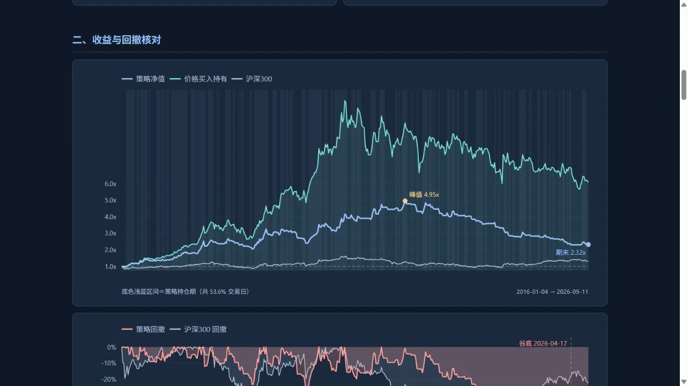

### 数据库：用过的数据，继续用

按行情、新闻、基本面等用途管理缓存，查看来源、日期范围、行列数与内容。支持搜索、更新、删除和批量管理；研究时优先检查已有缓存，缺少或过期的数据再按需获取。

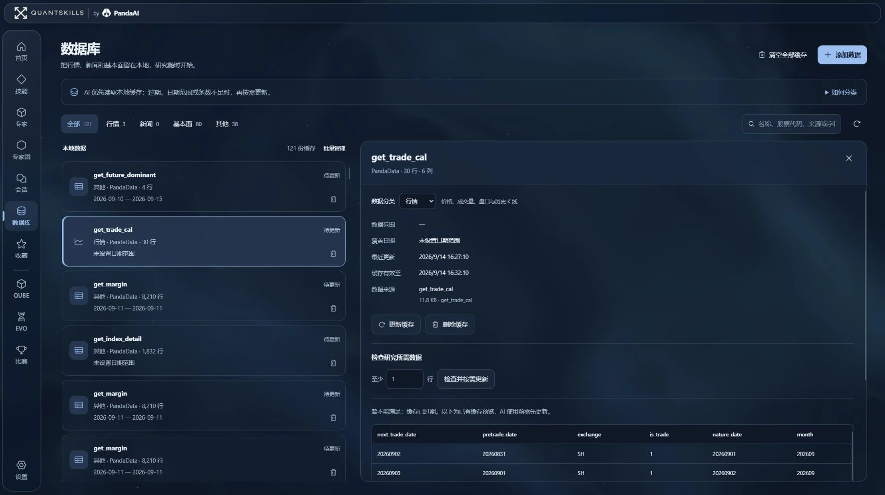

### 比赛：研究、计划、确认与跟踪

**期货模拟赛**：连接赛事账户后，查看资金、持仓、委托、成交、排名与行情。进入 AI 交易助手，研究品种、巡检账户、复盘交易；写入操作通过计划卡确认。[期货比赛说明](docs/contest.md)。

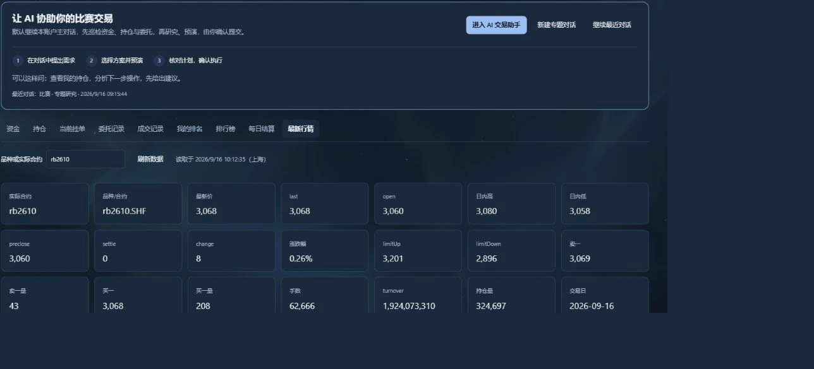

**第四届因子大赛**：提出研究目标，确认批次预算，查看研究与回测记录，筛选因子并管理因子池。入池、修改和正式提交均通过确认计划执行。赛事账户、报名、Python 与相关权限需按接入说明配置；算力阈值是停止追加的条件，不是平台支出封顶。[因子比赛说明](docs/factor-contest.md)。

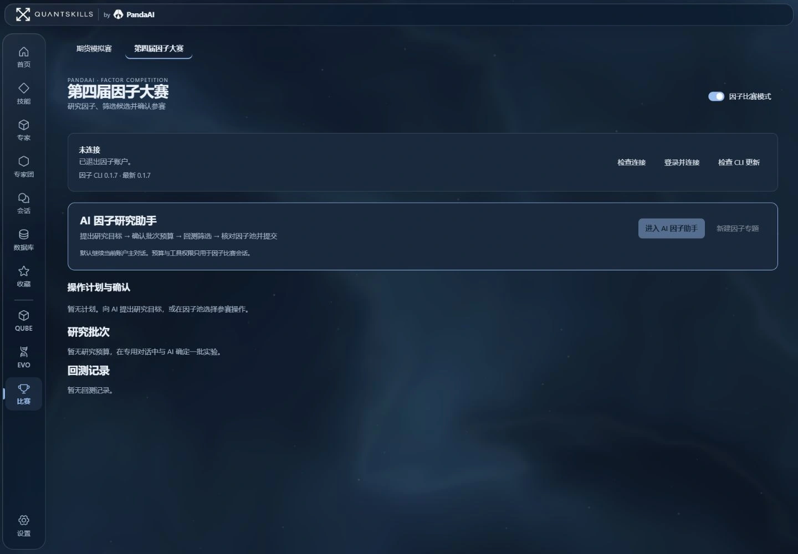

### 外观：让工作空间更像你

极简·雾蓝的流动背景，云白的清晰留白，青玉的安静与水墨的层次。主题同时调整界面、图标与强调色；可以关闭动态背景，分别调整界面和对话字号。

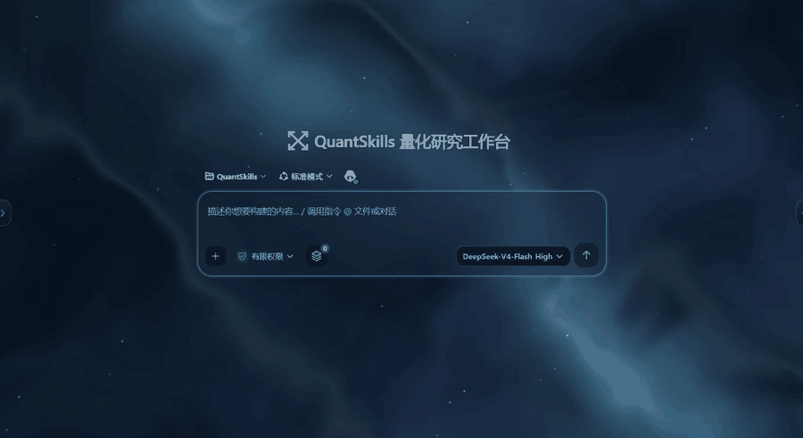

<details>
<summary>查看外观设置与更多主题</summary>

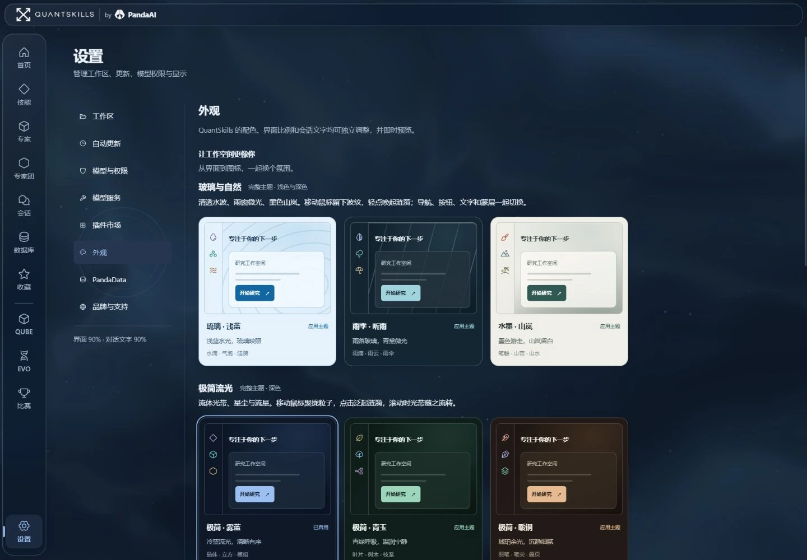

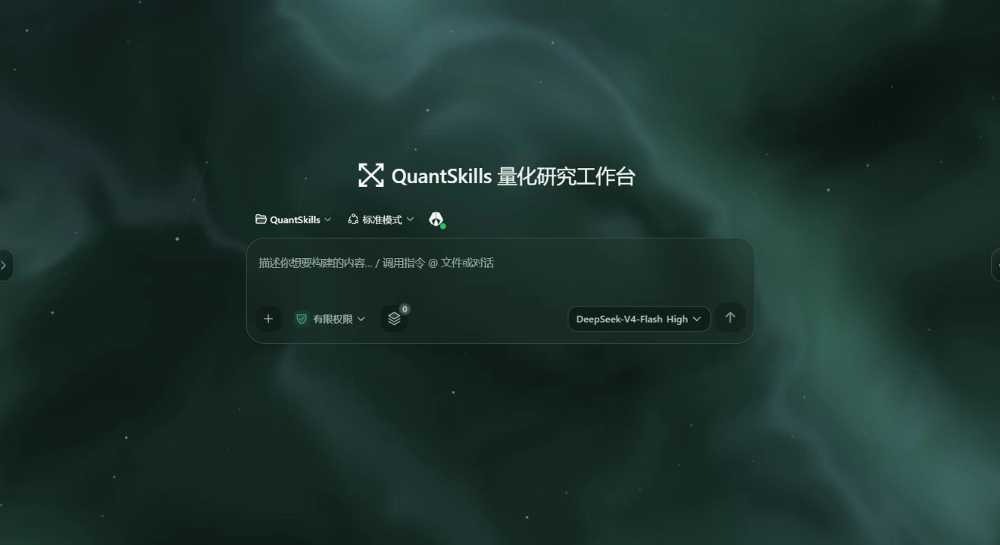

</details>

### QUBE 与 EVO：连接更多研究工具

| 产品 | 用途 | 入口 |
| --- | --- | --- |
| **QUBE** | 自然语言构建策略、回测与验证想法 | [体验 QUBE](https://www.pandaaiquant.com/agent_quant/) |
| **EVO** | 因子、策略、研究环境与协作 | [体验 EVO](https://www.pandaaiquant.com/evo/) |

工作台提供介绍和入口，点击后进入对应独立服务。

## 开始使用

准备 Git，以及 **Node.js 22.19+ 的 22.x 版本，或 Node.js 24+**。项目固定 pnpm 11.7.0。Windows、macOS 与 Linux 使用同一启动命令；macOS / Linux 无需 PowerShell。

```sh
git clone -c core.longpaths=true https://github.com/quantskills/QuantStudio.git
cd QuantStudio
corepack enable
pnpm install --frozen-lockfile
pnpm run web
```

国内网络可使用 Gitee 克隆地址：

```sh
git clone -c core.longpaths=true https://gitee.com/quantskills/QuantStudio.git
```

打开终端显示的地址，例如 **http://127.0.0.1:3198/**。首次配置模型服务后，即可新建会话。Python、PandaData MCP 和赛事 CLI 按具体任务需要配置；没有数据连接时仍可处理已提供的资料。

Windows 默认使用系统文档目录，macOS 使用 `~/Documents/QuantSkills`。配置目录默认为 `~/.dsh`，可通过 `DSH_HOME` 指定。macOS 如提示文稿目录权限，请允许启动终端访问。关闭服务按 `Ctrl+C`，再次运行启动命令即可继续。

本地运行时，会话、配置与文件保存在本机；模型和数据服务按你的配置联网。团队部署可以共用工作区、会话与产物，**不等同于成员间的数据隔离**；并发能力取决于模型服务、任务负载和服务器配置。

## 更新应用，保留自己的内容

选择 GitHub 或 Gitee 来源，检查正式版本。**有更新时按钮变色，并展示版本号和更新内容**；点击确认后下载安装。

| 更新内容 | 保留内容 |
| --- | --- |
| 应用代码、界面、运行包与内置模板 | 自建及已安装技能、专家、专家团 |
| 正式版本资源与依赖 | 会话、模型配置、凭据、缓存与工作区产物 |

候选版本在独立目录验证，等待下次正常启动切换，启动失败可回滚。仅推送 `main` 而未发布正式版本标签，不会触发安装。从旧仓库迁移时请克隆新目录并保留原工作区和 `DSH_HOME`，不要强制覆盖旧开发目录。[发布与镜像说明](docs/publishing.md)。

## 开发、来源与许可

```sh
pnpm run check
pnpm run test
pnpm run test:update
pnpm run ci:smoke
```

源码位于 `src/` 与 `packages/`，构建产物位于 `lib/`，能力快照位于 `assets/library-v2/`。项目集成固定版本的 DSH 运行时及相关组件。[运行时基线](SOURCE_BASELINE.md) · [版本记录](RELEASE_NOTES.md) · [宣传素材说明](docs/launch/README.md)。

QuantStudio 使用 [GPL-3.0-or-later](LICENSE) / [PandaAI 商业授权](COMMERCIAL-LICENSE.md) 双授权。第三方组件遵循各自许可证，版权与来源见 [第三方声明](THIRD_PARTY_NOTICES.md) 和 `LICENSES/`。

[QuantSkills 官网](https://www.quantskills.ai/) · [PandaAI 官网](https://www.pandaaiquant.com/)
