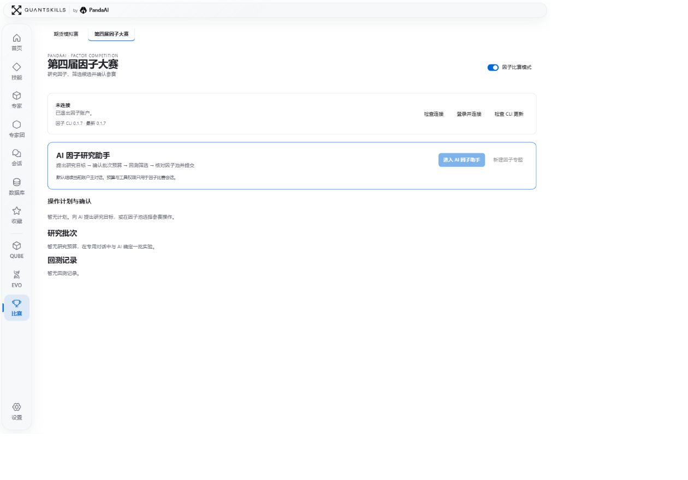

<div align="center">

# QuantStudio

### AI 时代，你的个人开源量化工作台。

**Quant · Work · Trade**

源于 PandaAI 旗下的 QuantSkills 开源社区

[开始使用](#开始使用) · [功能一览](#工作台里的每个栏目) · [Jev 盯盘](#jev持续盯盘与交易方案评估) · [English](README.en.md) · [Gitee 镜像](https://gitee.com/quantskills/QuantStudio) · [公众号图文](docs/launch/wechat.md)


</div>

**把研究方法、专业角色、团队协作和实际产物，放在同一张工作台。**

QuantStudio 面向量化研究者、投研人员和希望用 AI 完成日常工作的人。从一句需求开始，调用技能、选择专家或组织专家团，在对话中推进任务，直接检查生成的报告、图表、代码和文件。

支持 Windows、macOS、Linux 本地运行，也可部署为团队共享工作区。当前界面中的 QuantSkills 标识代表项目所属社区与能力体系。

## Quant · Work · Trade

| 方向 | 从什么问题开始 | 交付什么 |
| --- | --- | --- |
| **Quant · 量化与投研** | 每日复盘、热点追踪、资金分析、因子挖掘、策略编写与回测审查 | 研究报告、因子评估、图表、可复核代码与数据 |
| **Work · 日常工作** | 整理资料、清洗表格、会议纪要、经营分析、制作汇报与客户方案 | 文档、工作簿、演示文稿、行动清单 |
| **Trade · 赛事实践** | 巡检期货模拟赛账户、研究合约、预演交易计划、开展因子赛研究 | 待确认计划、执行回执、研究批次与因子池记录 |

### Quant：从研究问题，到可检查的结果

> 把已有双均线回测整理成研究报告，核对数据、成本与策略局限。

读取资料、拆解问题、执行工具、核对结论，都可以在同一段对话中完成。右侧结果工作台直接打开 HTML 报告、曲线、表格与代码；继续追问时，研究上下文仍然保留。


图中为既有回测文件的核对案例，展示研究与验证流程；历史结果不代表未来收益。

### Work：把资料，变成可交付的文件

> 合并这些销售表，按月份和部门统计，再做一份汇报。

选择 Excel 数据、会议纪要、办公文稿、PPT 汇报等专家，围绕你的材料完成整理、分析与表达。复杂的周报月报、客户提案和项目交付，可以交给专家团分工完成。


具体文件格式取决于当前模型、技能与文档运行环境；交付后可以打开文件复核。

### Trade：研究、预演，由你确认执行

通过 **PandaAI CLI 与赛事接口**，接入期货模拟赛和第四届因子大赛。两类赛事有各自的账户连接与研究会话。

- **期货模拟赛**：查看资金、持仓、委托、成交、排名和行情。AI 先巡检账户、研究品种，再形成交易计划；开仓、平仓、撤单等写入操作由你核对后确认，执行状态与回执可追踪。
- **因子大赛**：提出目标，确认研究批次与预算，查看回测记录，筛选候选并管理因子池。入池、修改、删除和参赛提交通过确认计划执行。


<details>
<summary>查看第四届因子大赛入口</summary>



</details>

赛事功能需配置账户、Python 和相关权限。期货功能对应模拟赛事；自动巡检只读账户，不会自动下单。因子研究的算力阈值用于停止追加任务，不是平台费用封顶。[期货比赛说明](docs/contest.md) · [因子比赛说明](docs/factor-contest.md)

### Jev：持续盯盘与交易方案评估

QuantStudio 已在开发分支接入 [TypeSafe Jev](https://docs.typesafe.ai/introduction)，将行情采样、策略判断、账户巡检和交易计划接到同一个期货模拟赛工作台。Jev 根据已完成 K 线、实时行情快照、持仓及策略约束，评估当前市场状态，给出观望、开多、开空、平多或平空建议；你可以查看判断依据，再决定是否执行计划。

> **接入状态（2026-09-18）**：相关功能见 [PR #8](https://github.com/quantskills/QuantStudio/pull/8)，目前仍在审查，尚未合入 `main`。直接克隆主线暂不包含 Jev 入口。

| 能力 | 可以做什么 |
| --- | --- |
| **策略模板** | 选择区间回归、趋势回调、突破跟随，或自建并保存策略；调整合约、手数、采样频率和决策间隔。 |
| **持续盯盘** | 通过 PandaData 准备分钟行情，结合比赛账户的实时报价、资金、持仓与活动委托持续分析。 |
| **判断与复核** | 查看市场状态、策略适用性、主要阻碍、动作概率及历史分析；区分数据不足、程序约束和模型主动观望。 |
| **约束与模式** | 配置允许方向、价差上限、开仓冷却、计划数量和权益回落停止线；自主模式由 Jev 综合判断，严格模式先按策略规则筛选。两种模式都保留账户与数据有效性检查。 |
| **计划与回执** | 符合条件时生成待确认交易计划；生成前重新核验账户与行情，确认提交后继续查询委托与成交记录。 |

在包含该功能的版本中，进入 **比赛 → 期货模拟赛 → Jev 持续盯盘**，配置自己的 TypeSafe API Key、连接比赛账户与 PandaData，选择模板并核对参数后即可启动。密钥保存在本机凭据库；界面可以查看请求记录和返回的 token 用量。自定义中文策略支持选择已验证的模型进行翻译，原文保留，翻译与 Jev 调用分别产生用量。

比赛专用对话也可调用 Jev，对候选方案的证据充分性、支持程度和风险进行评估。**持续盯盘负责分析和生成计划，每笔交易仍需你确认。** 权益停止线只暂停盯盘，不自动平仓；动作概率与置信度表示模型判断，不是交易胜率。当前期货 CLI 联动支持 Windows、macOS 本机运行。

## 技能、专家、专家团：你的能力库

### 技能｜让方法可以复用

技能保存方法、步骤与工具使用约定。按任务发现和安装已有技能，也可以用一句话让 AI 起草自己的技能，确认后保存，在会话中按需加载。

> 把刚才的复盘流程，做成一个每日复盘技能。


### 专家｜让能力有明确职责

专家把角色职责、工作约定和技能组合起来。选择个股研究、财报解读、因子挖掘、策略回测或办公专家，即可开始专门的对话，也可以创建自己的专家。

> 创建一位市场研究专家，使用我的每日复盘技能。


### 专家团｜让复杂任务有分工

专家团定义负责人、成员、任务依赖和交付要求。可以使用公司研究、每日市场研究、多因子选股等团队，也可以向 AI 描述目标，生成团队草案，确认后再开展协作。

> 组一个投研专家团，分别负责热点、资金和策略审查。


仓库附带可迁移能力快照：**15 个技能、44 个专家定义、14 个专家团**。它与在线目录、推荐列表是不同集合，不包含模型密钥或会话历史；仅在明确导入时写入空能力库。[快照与导入说明](docs/library-snapshot.md)

## 数据与产物，留在工作区里

**数据库**集中管理行情、新闻、基本面等本地缓存。搜索数据、查看来源与日期范围、预览表格，按需刷新或清理。研究任务优先检查已有缓存，过期或不足时再获取。


**结果工作台**集中展示报告、图表、代码和文件，支持 HTML、Markdown、PDF 等预览与下载。侧栏可收起、调整宽度；会话与轨迹保留工作过程，方便继续研究和核对交付。

## 工作台里的每个栏目

| 栏目 | 用途 |
| --- | --- |
| **首页** | 描述需求、发现公开能力、继续最近工作。 |
| **技能** | 发现、安装、创建与管理可复用方法。 |
| **专家** | 选择角色、绑定技能，开始或继续专属对话。 |
| **专家团** | 编排成员、职责和流程，围绕同一目标协作。 |
| **会话** | 管理普通、技能、专家与专家团会话；查看对话、轨迹与产物。 |
| **数据库** | 查看、搜索和管理本地数据缓存。 |
| **收藏** | 保留常用能力，快速继续工作。 |
| **比赛** | 进入期货模拟赛与第四届因子大赛工作台。 |
| **QUBE / EVO** | 查看介绍并进入 PandaAI 对应的独立研究服务。 |
| **设置** | 配置工作区、模型、权限、插件、PandaData、外观与更新。 |

主题同时调整界面、图标和强调色，支持动态背景开关，以及界面与对话字号独立设置。本页截图全部采用白色主题。[QUBE](https://www.pandaaiquant.com/agent_quant/) · [EVO](https://www.pandaaiquant.com/evo/)

## 开始使用

准备 **Git** 和 **Node.js 22.19+ 的 22.x 版本，或 Node.js 24+**；项目固定使用 pnpm 11.7.0。Windows、macOS、Linux 使用同一启动命令，macOS / Linux 不依赖 PowerShell。

```sh
git clone -c core.longpaths=true https://github.com/quantskills/QuantStudio.git
cd QuantStudio
corepack enable
pnpm install --frozen-lockfile
pnpm run web
```

国内网络可将克隆地址替换为：

```sh
git clone -c core.longpaths=true https://gitee.com/quantskills/QuantStudio.git
```

打开终端显示的地址，例如 `http://127.0.0.1:3198/`。在「设置 → 模型服务」中配置模型后，新建会话即可开始。Python、PandaData MCP 和赛事 CLI 按任务需要配置；处理已有资料不要求先连接行情服务。

配置目录默认位于 `~/.dsh`，可用 `DSH_HOME` 指定；工作区在设置中查看和选择。按 `Ctrl+C` 关闭本地服务，再次运行启动命令即可继续。

本地运行时，会话、配置与文件保存在本机，模型与数据服务按你的配置联网。团队部署可以共享工作区、会话和产物，**共享部署不提供成员间的数据隔离**；并发体验取决于模型配额、任务负载与服务器配置。

## 更新与自己的内容

应用支持选择 GitHub / Gitee 更新来源。发现正式版本时，更新按钮变色，并展示版本与更新内容。更新应用代码、界面和内置资源时，保留自建能力、会话、模型配置、凭据、缓存和工作区产物。

候选版本在独立目录验证，等待下次正常启动切换，启动失败可回滚。仅推送 `main` 而未发布正式版本标签，不会触发安装。从旧仓库迁移时，请克隆新目录并保留原工作区与 `DSH_HOME`。[发布与镜像说明](docs/publishing.md)

## 开发与开源许可

```sh
pnpm run check
pnpm run test
pnpm run test:update
pnpm run ci:smoke
```

源码位于 `src/` 与 `packages/`，构建产物位于 `lib/`，能力快照位于 `assets/library-v2/`。[运行时基线](SOURCE_BASELINE.md) · [版本记录](RELEASE_NOTES.md) · [宣传片与图文素材](docs/launch/README.md)

QuantStudio 源于 **PandaAI 旗下的 QuantSkills 开源社区**，采用 [GPL-3.0-or-later](LICENSE) / [PandaAI 商业授权](COMMERCIAL-LICENSE.md) 双授权。第三方组件遵循各自许可证，来源与版权信息见 [第三方声明](THIRD_PARTY_NOTICES.md) 和 `LICENSES/`。

<div align="center">

**QuantStudio · by PandaAI**

[QuantSkills 官网](https://www.quantskills.ai/) · [PandaAI 官网](https://www.pandaaiquant.com/) · [GitHub](https://github.com/quantskills/QuantStudio) · [Gitee](https://gitee.com/quantskills/QuantStudio)

</div>
