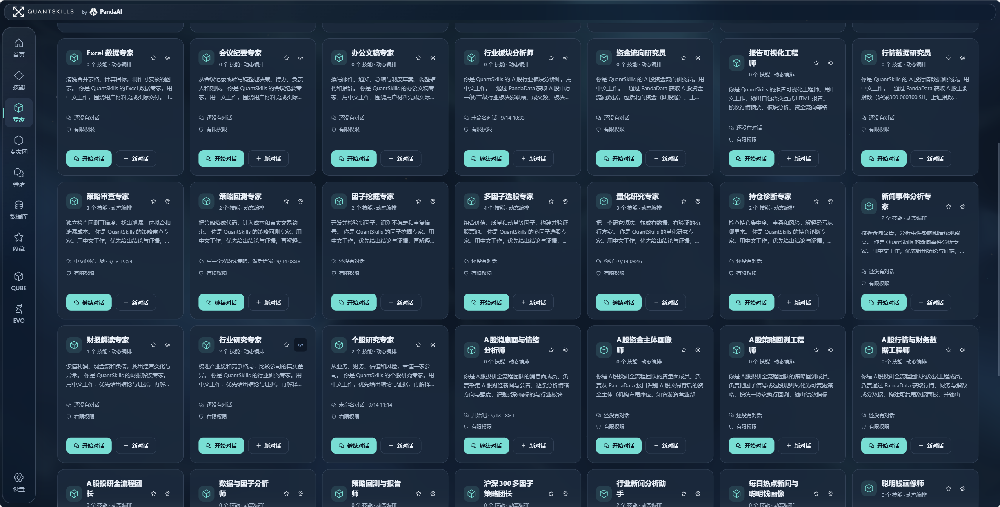
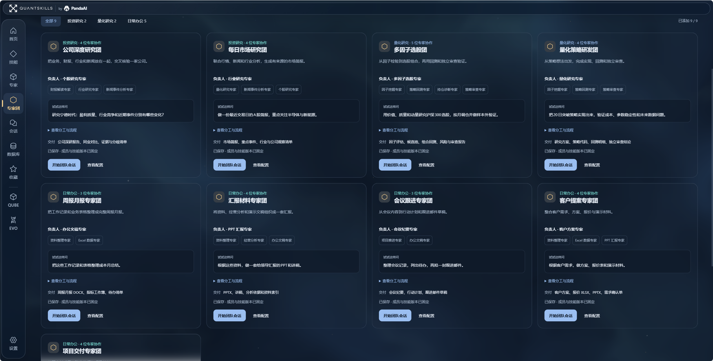
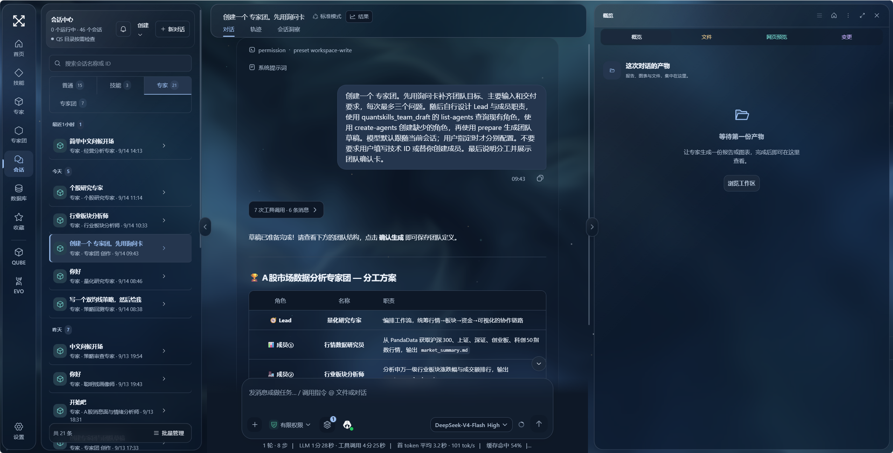
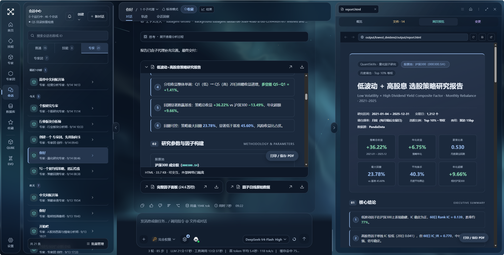
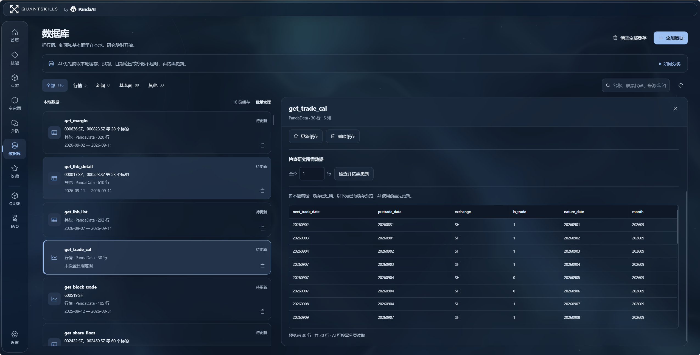

# QuantStudio

### 量化研究与日常办公，从一句需求到一份交付。

[开始使用](#开始使用) · [English](README.en.md) · [版本更新](RELEASE_NOTES.md) · [GitHub](https://github.com/quantskills/QuantStudio) · [Gitee 国内镜像](https://gitee.com/quantskills/QuantStudio)

QuantStudio 是 QuantSkills / PandaAI 的本地 AI 工作台。你可以验证一个选股思路、研究一家公司的财报，也可以整理 Excel、写月报或准备汇报材料。选择合适的技能与专家，在对话中推进任务，直接查看生成的报告、图表、代码和文件。

项目集成固定版本的 DSH 运行时、界面与启动器，安装后即可运行。会话、个人能力库和工作文件保存在本机；模型与外部数据服务按你的配置联网。

## 先说任务，再选怎么做

| 你想完成的事 | 可以交给谁 | 查看哪些成果 |
| --- | --- | --- |
| “用低波动和高股息选股，做一次样本外验证。” | 多因子选股团 | 因子评估、组合回测、风险与审查报告 |
| “研究这家公司，核对财报、行业地位和近期事件。” | 公司深度研究团 | 公司报告、同业对比、来源与分歧清单 |
| “把 20 日突破思路写成策略，检查成本和未来数据问题。” | 量化策略研发团 | 策略代码、回测明细、独立审查结论 |
| “把这些工作记录和表格整理成本月总结。” | 周报月报专家团 | 月报文档、指标工作簿、待办清单 |
| “根据资料准备一套汇报 PPT 和讲稿。” | 汇报材料专家团 | 演示文稿、讲稿、分析依据与资料索引 |

这些是任务示例。实际结果取决于模型能力、输入资料、可用工具与数据权限，研究结论可以沿着过程和产物继续检查。

## 技能、专家、专家团，各有用途

**技能是一套可复用的方法。** 把数据处理、因子评估或报告生成流程保存下来，下次直接调用。

**专家负责一类具体工作。** 量化研究、策略回测、因子挖掘、财报解读、新闻事件分析，以及 Excel 数据、会议纪要、办公文稿等角色，都能独立开始会话。你也可以创建自己的专家，配置职责与技能。

**专家团负责需要多人分工的任务。** 每个团队有负责人、成员、工作流程与交付要求。负责人组织任务，成员各自完成分析，再汇总与核对。

不确定怎样组队时，可以直接描述目标，让创作助手补齐必要信息，生成团队草案，确认后保存。在会话输入框中也可按来源选择技能、专家或专家团。

查看对话创建专家团的实际界面

仓库随附可迁移能力快照：**15 个技能、44 个专家定义、14 个专家团**，专家定义包含创作助手。快照保留技能版本与依赖关系，不包含模型密钥或会话历史；仅在明确导入时写入空能力库。[查看能力快照与导入方式](docs/library-snapshot.md)。

## 讨论和成果，在同一张工作台上

左侧切换会话，中间查看任务过程，右侧打开产物。报告中的结论、回测数据和图表可以一起核对，无需在聊天记录中反复寻找文件。

支持 Markdown、HTML、PDF、代码与数据文件预览。图片可双击放大、滚轮缩放；产物可下载，继续编辑或复现。HTML 报告可以直接在会话和右侧预览中打开。

查看交互式研究报告

截图展示一次具体研究任务的产物，不代表策略未来表现。

## 行情、新闻、基本面，留在本地继续用

数据库按研究用途分类，展示数据来源、日期范围、行列数与缓存状态。AI 优先检查已有缓存，过期或范围不足时再按需获取。

左侧列表与右侧详情独立滚动；支持搜索、更新、单条删除、批量管理及清空缓存。PandaData 和其他外部数据需要配置相应连接与权限。

## 按自己的习惯工作

- **主题**：默认极简·雾蓝，也提供浅蓝玻璃、雨季、水墨等主题；可关闭动态背景。
- **模型**：首次使用未配置模型时引导设置，可按自己的服务配置选择模型。
- **屏幕**：桌面侧栏可收起、调整宽度；移动端采用抽屉式导航和结果面板。
- **能力库**：自建内容由你管理，应用更新与个人内容分开保存。

## 开始使用

Windows 与 macOS 使用相同的 `pnpm run web` 启动命令。Windows 支持 Windows PowerShell / PowerShell 7；macOS 无需 PowerShell。默认工作区分别使用 Windows 的系统文档目录和 macOS 的 `~/Documents/QuantSkills`，应用配置默认位于 `~/.dsh`，也可用 `DSH_HOME` 指定。

macOS 首次访问“文稿”目录时，如系统弹出权限提示，请允许启动应用的终端访问该目录。关闭终端中的应用可按 Ctrl+C；再次在项目目录运行启动命令即可继续使用。

需要 Git，以及 Node.js **22.19 或以上的 22.x 版本，或 24 及以上版本**。项目固定 pnpm 11.7.0 与 DSH 0.1.2-alpha.2；已提交可运行的构建产物。

~~~sh
git clone -c core.longpaths=true https://github.com/quantskills/QuantStudio.git
cd QuantStudio
corepack enable
pnpm install --frozen-lockfile
pnpm run web
~~~

国内网络可把克隆命令替换为：

~~~sh
git clone -c core.longpaths=true https://gitee.com/quantskills/QuantStudio.git
~~~

启动后打开终端显示的本机地址，例如 [http://127.0.0.1:3198/](http://127.0.0.1:3198/)。本机浏览器无需复制 Token；远程或代理请求仍受来源与认证检查。首次打开后配置模型，再选择专家或新建会话。

Python 和数据服务按任务需要单独配置。应用不会因尚未安装 Python 或尚未登录 PandaData 而阻止普通对话。所有命令都在项目根目录执行。

## 更新应用，保留自己的内容

首页自动检查所选 GitHub / Gitee 来源中的正式版本，也可手动检查。**有更新时按钮变色，展示版本号和更新内容**。下载与安装需要你点击确认。

| 会更新 | 保持原样 |
| --- | --- |
| 应用代码、界面、运行包与内置推荐模板 | 自建及已安装技能、专家、专家团 |
| 正式版本附带的静态资源 | 会话历史、数据库缓存、模型配置与凭据 |
| 已验证的版本依赖 | 工作区文件与生成产物 |

候选版本在独立目录下载，经过依赖安装、类型检查和启动测试后，等待下次正常启动切换；启动失败会回滚。只发布到 main 而未创建正式版本标签的提交不会触发安装。

**从旧仓库迁移**：QuantStudio 使用独立 Git 历史。请克隆到新目录，保留原 DSH_HOME 与工作区；不要在旧开发目录强制拉取或重置。自定义分支、本地修改和分叉历史会受到更新保护。能力快照仅在明确导入时写入空能力库。

## PandaAI 产品入口

| 产品 | 适合的工作 | 入口 |
| --- | --- | --- |
| QUBE | 用自然语言构建策略、运行回测与快速验证想法 | [开始体验 QUBE](https://www.pandaaiquant.com/agent_quant/) |
| EVO | 因子、策略与研究环境中的持续研究和协作 | [开始体验 EVO](https://www.pandaaiquant.com/evo/) |

应用内提供产品介绍与真实界面展示，点击“开始体验”后进入对应服务。

## 开发与验证

~~~sh
pnpm run check
pnpm run test
pnpm run test:update
pnpm run ci:smoke
~~~

正式发布后验证两个远端与真实更新流程：

~~~sh
pnpm run verify:update-mirrors
pnpm run verify:update-live github
pnpm run verify:update-live gitee
~~~

真实更新验证使用临时目录，覆盖匿名访问、下载、安装、启动切换和个人数据保持。源码位于 src/ 和 packages/，构建产物位于 lib/，能力快照位于 assets/library-v2/。[运行时基线](SOURCE_BASELINE.md) · [发布与镜像说明](docs/publishing.md)。

## 许可证

QuantStudio 使用 [GPL-3.0-or-later](LICENSE) / [PandaAI 商业授权](COMMERCIAL-LICENSE.md) 双授权。集成的 DSH 及其他第三方组件遵循各自许可证；相关版权与许可证保留在 [第三方声明](THIRD_PARTY_NOTICES.md) 和 LICENSES/ 中。

本仓库以独立历史发布，由 QuantSkills 维护。第三方组件的来源和授权声明不因仓库历史重建而改变。
