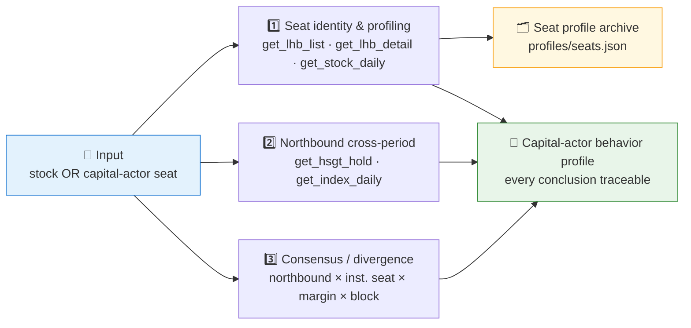
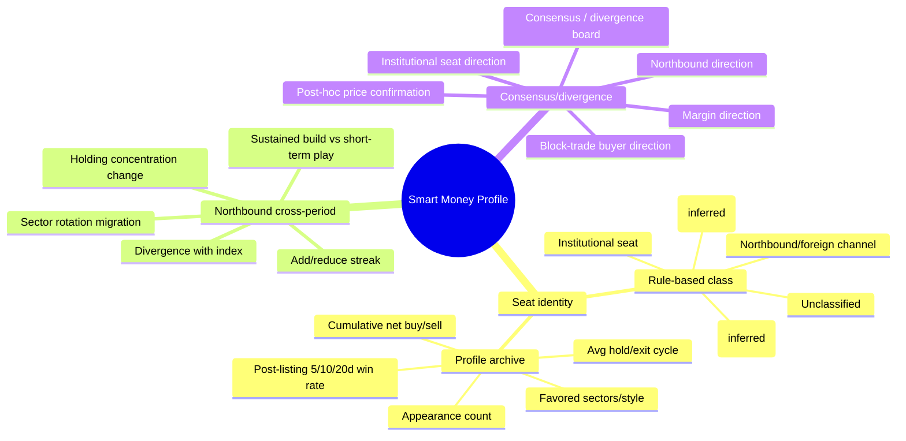
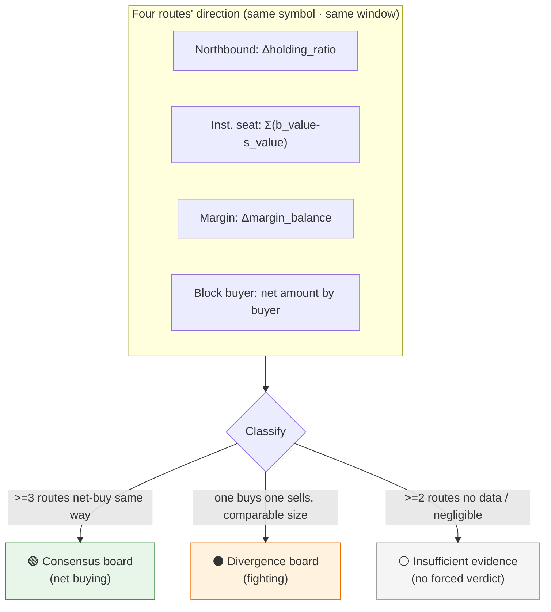

# 🕵️ Smart Money Profiler Skill

[简体中文](README.md) | **English**

> It doesn't predict up or down. It answers two things: **who is buying and selling**, and **how they habitually behave**. It chains 龙虎榜 seats, northbound holdings, margin balances, and block trades into "capital-actor identity + cross-period behavior profiling" — every conclusion traceable.

<p align="center">
  
  
  
  
  
  
</p>

---

## 📖 What is this

`smart-money-profiler` is an **Agent Skill** that tracks the **capital actors** behind A-share trading — identifying *who* is buying/selling and profiling *how they habitually behave across time*. It organizes 12+ Pandadata interfaces (龙虎榜, northbound holdings, margin financing, block trades) into **3 pillars** and produces a traceable "capital-actor behavior profile" report.

Its unique capability is **turning trading activity back into named capital actors**: 龙虎榜 names like `机构专用`, `深股通专用`, and well-known 游资 seats are classified into a maintainable identity dictionary; each seat accumulates a persistent profile (appearance count, cumulative net buy/sell, post-listing 5/10/20-trading-day win rate, average hold/exit cycle, favored sectors); then northbound, institutional seats, margin financing, and block-trade buyers are overlaid to see whether the four routes **act in consensus** or **fight each other**.

> ⚠️ This is **descriptive behavior tracking, not a predictive signal**. Seat identity labels come from rule matching and are not official designations; win rates are a backward look at past post-listing moves, not a promise about the future.
>
> All data contracts come from the sibling skill [`pandadata-api`](https://github.com/quantskills/skill-pandadata-api); this skill decides *who to query and how to profile*, not *what the interfaces look like*.

---

## 🧭 Boundary vs Three Adjacent Skills (important)

This skill deliberately avoids three existing territories — do not conflate them:

| What it does NOT do | Who does it | One-line distinction |
|---|---|---|
| ❌ Backtestable factors (IC/RankIC, look-ahead checks, grouped backtests, production factor files) | [`a1-lhb-tracking`](https://github.com/quantskills/skill-a1-lhb-tracking) | That one **turns behavior into an alpha factor and backtests it**; this one only **describes behavior**. |
| ❌ Over-heating / crowding / stampede risk grading and alerts | [`agent-crowding-risk-monitor`](https://github.com/quantskills/agent-crowding-risk-monitor) | That one judges **"is it too crowded?"**; this one judges **"who is it, and do the routes agree?"** |
| ❌ Single-day whole-market close review snapshot | [`market-daily-review`](https://github.com/quantskills/skill-market-daily-review) | That one is a **single-day snapshot**; this one is **cross-period / time-series** tracking. |

**This skill's exclusive value = identity (who) + cross-period profiling (how they habitually act) + multi-source consensus/divergence (do the routes agree).** If the user wants to turn a behavior signal into a backtestable factor, hand off to `a1-lhb-tracking`.

---

## ⚡ Three-Pillar Profiling Pipeline



### 🧠 Mind map: what the three pillars ask



---

## 🗂️ Three Pillars × Interface Map

| Pillar | Interfaces | Question answered |
|---|---|---|
| 1️⃣ **Seat identity & profiling** | `get_lhb_list` · `get_lhb_detail` · `get_stock_daily` | Who are the listed buy/sell seats? Which actor class? Their frequency / net buy-sell / post-listing win rate / hold cycle / favored sectors? |
| 2️⃣ **Northbound cross-period** | `get_hsgt_hold` · `get_index_daily` · `get_stock_daily` | Is northbound steadily adding or reducing (streak)? How does concentration change? Divergence with the index? Sustained build vs short-term play? |
| 3️⃣ **Consensus / divergence** | `get_hsgt_hold` · `get_lhb_detail` · `get_margin` · `get_block_trade` · `get_stock_daily` | Do northbound, institutional seats, margin, and block-trade buyers agree? Consensus or fighting? How does later price confirm it? |
| 🧩 **Support: sector attribution** | `get_stock_detail` · `get_stock_industry` · `get_concept_constituents` | Which industry/concept the stock belongs to — for seat preference and northbound rotation. |
| 🧱 **Support: long-term confirmation** | `get_top_holders` · `get_holder_count` | Quarterly institutional in/out, corroborating the short-term capital picture. |
| 📅 **Support: calendar & windows** | `get_trade_cal` · `get_last_trade_date` · `get_prev_trade_date` | Count the "post-listing N days" window in trading days, not calendar days. |

---

## 🚦 Consensus / Divergence Decision



Detailed rules, net-direction definitions, and post-hoc confirmation wording live in [`references/profiling-playbook.md`](references/profiling-playbook.md).

---

## 🚀 Quick Start

### 1️⃣ Install (together with pandadata-api)

```bash
# Claude Code (global)
cp -r skill-pandadata-api          ~/.claude/skills/pandadata-api
cp -r skill-smart-money-profiler   ~/.claude/skills/smart-money-profiler

# Codex (global, Agent Skills standard directory recommended)
mkdir -p ~/.agents/skills
cp -r skill-pandadata-api          ~/.agents/skills/pandadata-api
cp -r skill-smart-money-profiler   ~/.agents/skills/smart-money-profiler

# Cursor (project level)
mkdir -p .cursor/skills
cp -r skill-pandadata-api          .cursor/skills/pandadata-api
cp -r skill-smart-money-profiler   .cursor/skills/smart-money-profiler
```

### 2️⃣ Ask in natural language

```text
Profile the capital actors behind 000001.SZ — who's buying/selling lately, do the routes agree?
Profile the "机构专用" seat: appearance count, cumulative net buy/sell, post-listing 10-day win rate
Is northbound steadily building 603501 or just short-term playing? Any divergence with price?
List recently active well-known 游资 seats and the sectors they favor
```

### 3️⃣ Report structure

```
Profile summary → Seat identity & profiling → Northbound cross-period → Consensus/divergence
→ (Long-term confirmation) → Data appendix
```

The data appendix is a table: `data module | source interface | query window | rows returned | latest date/period | side/direction | notes`.

---

## 📦 Directory Layout

```
smart-money-profiler/
├── SKILL.md                          # Skill entry: workflow, three-pillar interface map, anti-collision boundary, rules, automation
├── references/
│   └── profiling-playbook.md         # 📒 Seat-label dictionary & rules, profile schema, win-rate/hold formulas, consensus/divergence rules, report skeleton, empty-data handling, QA checklist
├── profiles/
│   └── seats.json                    # 🗂️ Persistent seat profile archive (created/updated at runtime)
├── agents/
│   ├── cursor-rule.mdc               # Cursor adapter
│   ├── openai.yaml                   # OpenAI/Codex adapter
│   └── portable-loader.md            # Claude Code/Hermes/OpenClaw adapter
├── LICENSE                           # GPL-3.0-only
├── README.md                         # Simplified Chinese
└── README.en.md                      # English (this file)
```

---

## 📐 Core Constraints

| Constraint | Description |
|---|---|
| 🧾 Contract first | Every call is checked against `pandadata-api` for parameters and fields; no invented interfaces |
| 🏷️ Identity is inference | Seat labels come from rule matching, explicitly tagged "rule-matched/inferred, not official"; never presented as fact |
| 🧮 Transparent formulas | Net buy/sell `b_value-s_value`, post-listing N-day return, win rate, hold cycle, streak length must state their definitions |
| 📅 State the window | Post-hoc win-rate validation states post-listing 5/10/20 **trading days** and the price basis; `side=="cum"` rows excluded from net math |
| 🤝 List all four routes | Consensus/divergence verdicts list all four routes' directions, including "no data" routes |
| 🕳️ Report empty data honestly | Empty sections keep their heading plus "no data + interface/window"; never silently skipped, never estimated |
| 🗣️ Restrained wording | Use "may indicate" / "worth monitoring" / "same-direction/fighting"; no up/down calls, no buy/sell language |
| 🚫 Stay in lane | No factor/backtest output, no over-heating risk grade, no single-day whole-market review (see boundary table above) |

---

## ⚠️ Disclaimer

Reports are generated from public data and rule-based analysis, for research reference only. Nothing here constitutes investment advice.

## 📜 License

This project is licensed under the GNU General Public License v3.0. See [LICENSE](LICENSE).

## 🐼 PandaAI / QUANTSKILLS Community

<div align="center">
  
  <br>
  <sub>Scan the QR code to join the PandaAI community for QUANTSKILLS skills, agent workflows, and quantitative research practice.</sub>
</div>
