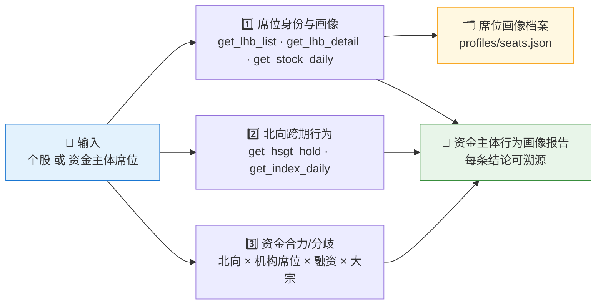
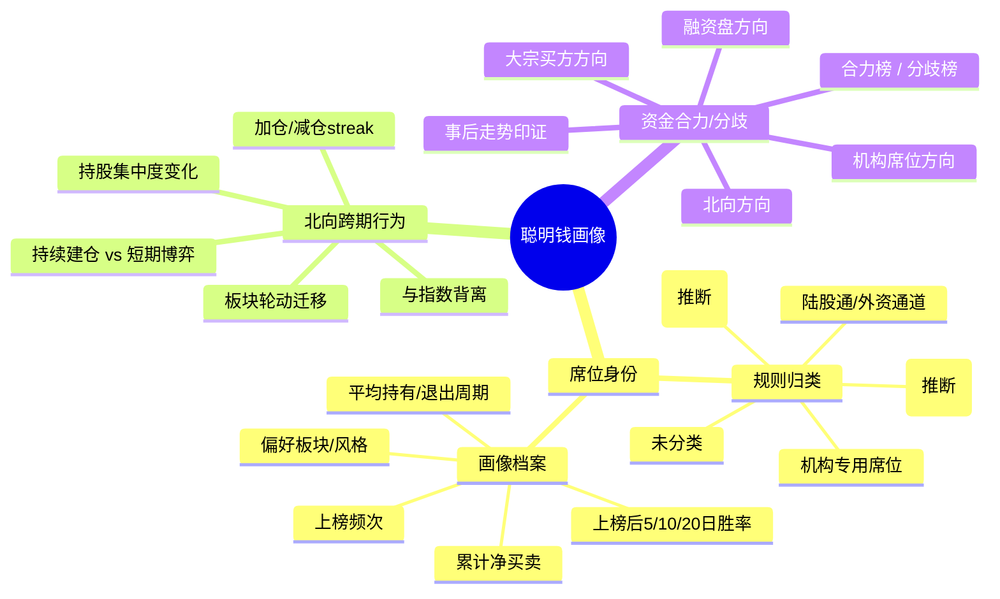
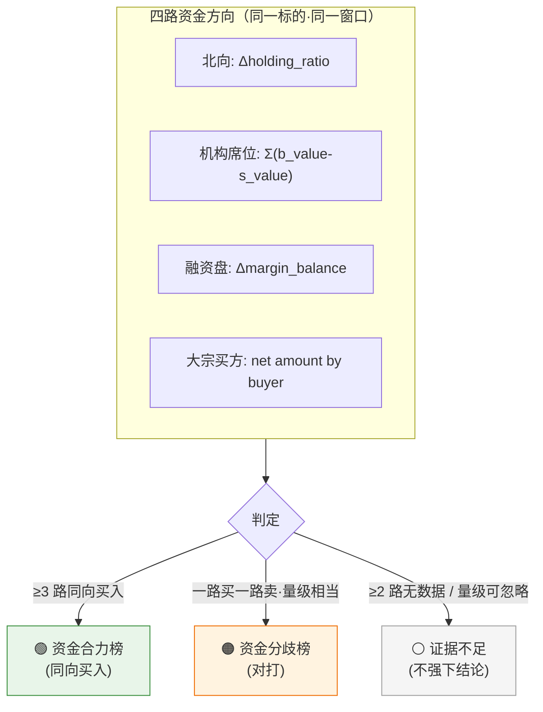

# 🕵️ Smart Money Profiler Skill

**简体中文** | [English](README.en.md)

> 不预测涨跌，只回答两件事：**谁在买卖**，以及**他们一贯怎么做**。把龙虎榜席位、北向资金、融资盘、大宗买方串成"资金主体身份识别 + 跨期行为画像"，每个结论可溯源。

<p align="center">
  
  
  
  
  
  
</p>

---

## 📖 这是什么

`smart-money-profiler` 是一个 **Agent Skill**：追踪 A 股背后的**资金主体**——既识别"是谁在买卖"，又刻画"他们跨期的一贯行为"。它把 Pandadata 的龙虎榜、北向持股、融资融券、大宗交易等 12+ 个接口，组织成 **3 大支柱**，输出一份可溯源的"资金主体行为画像报告"。

它最独特的能力是 **把交易行为还原成"有名有姓的资金主体"**：龙虎榜上的 `机构专用`、`深股通专用`、知名游资营业部，被归类成可维护的身份标签；每个席位累积出可持久化的画像档案（上榜频次、累计净买卖、上榜后 5/10/20 日胜率、平均持有/退出周期、偏好板块）；再把北向、机构席位、融资盘、大宗买方四路资金叠加，看它们是**合力同向**还是**互相对打**。

> ⚠️ 这是**描述性行为追踪，不是预测信号**。席位身份标签来自规则匹配，不等于官方认定；胜率是对历史上榜后走势的回看，不是对未来的承诺。
>
> 数据契约一律来自姊妹技能 [`pandadata-api`](https://github.com/quantskills/skill-pandadata-api)；本技能负责"查谁、怎么画像"，不负责"接口长什么样"。

---

## 🧭 与三个相邻技能的边界（重要）

本技能刻意避开三块已有领地，请勿混用：

| 不做什么 | 谁来做 | 一句话区分 |
|---|---|---|
| ❌ 可回测因子（IC/RankIC、未来函数检查、分组回测、生产因子文件） | [`a1-lhb-tracking`](https://github.com/quantskills/skill-a1-lhb-tracking) | 那边把行为**做成 Alpha 因子并回测**；本技能只**描述行为**。 |
| ❌ 过热 / 拥挤 / 踩踏风险评级与预警 | [`agent-crowding-risk-monitor`](https://github.com/quantskills/agent-crowding-risk-monitor) | 那边判**"是不是太挤了"**；本技能判**"是谁、几路资金是否同向"**。 |
| ❌ 单日全市场收盘复盘快照 | [`market-daily-review`](https://github.com/quantskills/skill-market-daily-review) | 那边是**单日快照**；本技能是**跨期/时间序列**追踪。 |

**本技能独有 = 身份识别（谁）+ 跨期画像（一贯怎么做）+ 多源合力/分歧（几路是否同向）。** 若用户想把某个行为信号做成因子回测，移交 `a1-lhb-tracking`。

---

## ⚡ 三支柱画像流水线



### 🧠 思维导图：三支柱在问什么



---

## 🗂️ 三支柱 × 接口映射

| 支柱 | 接口 | 回答什么 |
|---|---|---|
| 1️⃣ **席位身份与画像** | `get_lhb_list` · `get_lhb_detail` · `get_stock_daily` | 上榜买卖席位是谁？归哪类主体？该席位频次/净买卖/上榜后胜率/持有周期/偏好板块？ |
| 2️⃣ **北向跨期行为** | `get_hsgt_hold` · `get_index_daily` · `get_stock_daily` | 北向是持续加仓还是减仓（streak）？集中度怎么变？与指数是否背离？持续建仓还是短期博弈？ |
| 3️⃣ **资金合力 / 分歧** | `get_hsgt_hold` · `get_lhb_detail` · `get_margin` · `get_block_trade` · `get_stock_daily` | 北向、机构席位、融资盘、大宗买方四路是否同向？合力还是对打？事后走势怎么印证？ |
| 🧩 **辅助：板块归属** | `get_stock_detail` · `get_stock_industry` · `get_concept_constituents` | 标的属于哪个行业/概念，用于刻画席位偏好与北向轮动。 |
| 🧱 **辅助：中长期印证** | `get_top_holders` · `get_holder_count` | 季度机构股东进出，对短期资金画像做中长期印证。 |
| 📅 **辅助：日历与窗口** | `get_trade_cal` · `get_last_trade_date` · `get_prev_trade_date` | 用交易日（非自然日）计数"上榜后 N 日"窗口。 |

---

## 🚦 资金合力 / 分歧判定



判定细则、净方向口径与事后走势印证写法见 [`references/profiling-playbook.md`](references/profiling-playbook.md)。

---

## 🚀 快速开始

### 1️⃣ 安装（与 pandadata-api 一起）

```bash
# Claude Code（全局）
cp -r skill-pandadata-api          ~/.claude/skills/pandadata-api
cp -r skill-smart-money-profiler   ~/.claude/skills/smart-money-profiler

# Codex（全局，推荐开放 Agent Skills 标准目录）
mkdir -p ~/.agents/skills
cp -r skill-pandadata-api          ~/.agents/skills/pandadata-api
cp -r skill-smart-money-profiler   ~/.agents/skills/smart-money-profiler

# Cursor（项目级）
mkdir -p .cursor/skills
cp -r skill-pandadata-api          .cursor/skills/pandadata-api
cp -r skill-smart-money-profiler   .cursor/skills/smart-money-profiler
```

### 2️⃣ 直接用自然语言提问

```text
给 000001.SZ 做一份资金主体画像，看看最近谁在买卖、几路资金是否同向
帮我画像一下"机构专用"席位：上榜频次、累计净买卖、上榜后10日胜率
603501 北向最近是持续加仓还是短期博弈？和股价有没有背离？
列一下最近活跃的知名游资席位，以及它们偏好的板块
```

### 3️⃣ 报告结构

```
画像摘要 → 席位身份与画像 → 北向跨期行为 → 资金合力/分歧 →（中长期印证）→ 数据附录
```

数据附录为表格：`数据模块 | 来源接口 | 查询窗口 | 返回行数 | 最新日期/数据期 | side/方向 | 备注`。

---

## 📦 目录结构

```
smart-money-profiler/
├── SKILL.md                          # 技能入口：工作流、三支柱接口映射、反撞车边界、规则、自动化
├── references/
│   └── profiling-playbook.md         # 📒 席位标签字典与归类规则、画像档案字段、胜率/持有周期口径、合力/分歧判定、报告骨架、空数据处理、QA清单
├── profiles/
│   └── seats.json                    # 🗂️ 可持久化席位画像档案（运行时创建/更新）
├── agents/
│   ├── cursor-rule.mdc               # Cursor 适配
│   ├── openai.yaml                   # OpenAI/Codex 适配
│   └── portable-loader.md            # Claude Code/Hermes/OpenClaw 适配
├── LICENSE                           # GPL-3.0-only
├── README.md                         # 简体中文（本文件）
└── README.en.md                      # 英文版
```

---

## 📐 核心约束

| 约束 | 说明 |
|---|---|
| 🧾 先查契约 | 所有调用先经 `pandadata-api` 核对参数字段，不发明接口 |
| 🏷️ 身份是推断 | 席位标签来自规则匹配，明确标注"规则匹配/推断，非官方认定"，不把推断当事实 |
| 🧮 公式透明 | 净买卖 `b_value-s_value`、上榜后 N 日收益、胜率、持有周期、streak 长度等衍生量必须写出口径 |
| 📅 窗口讲清 | 事后胜率验证标明上榜后 5/10/20 **个交易日**及价格基准；`side=="cum"` 不计入买卖净额 |
| 🤝 列全四路 | 合力/分歧结论列出全部四路资金方向，含"无数据"的路 |
| 🕳️ 空数据如实报 | 无数据章节保留标题并写明"无数据 + 接口/窗口"，不静默跳过、不估算 |
| 🗣️ 措辞克制 | 用"可能提示""需要关注""同向/对打"，不下涨跌结论、不用买卖语言 |
| 🚫 不越界 | 不产因子/回测、不做过热风险评级、不做单日全市场复盘（见上方边界表） |

---

## ⚠️ 免责声明

本报告基于公开数据与规则化分析生成，仅供研究参考，不构成任何投资建议。

## 📜 License

This project is licensed under the GNU General Public License v3.0. See [LICENSE](LICENSE).

## 🐼 PandaAI / QUANTSKILLS 社群

<div align="center">
  
  <br>
  <sub>扫码加入 PandaAI 社群，交流 QUANTSKILLS 技能、Agent 工作流与量化研究实践。</sub>
</div>
