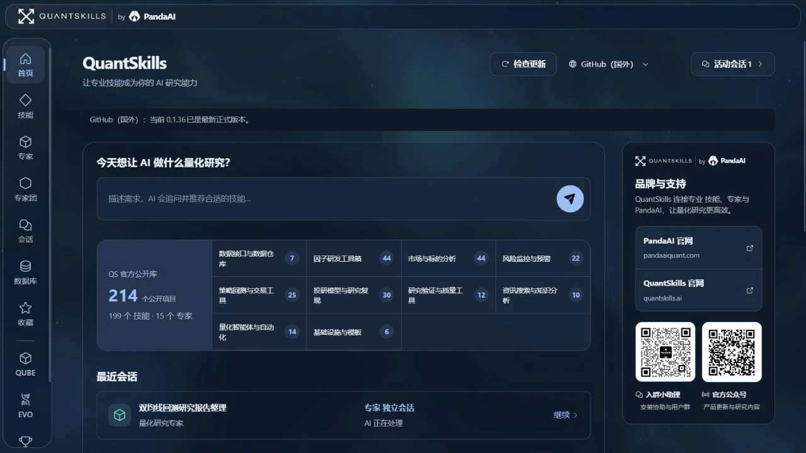

# QuantStudio：让研究想法，走到真实交付

<!-- 发布时在这里插入随包提供的「QuantStudio-中文字幕配乐版.mp4」原生视频。 -->

**先看 2 分 30 秒实机演示。** 输入目标、选择能力、查看过程，打开生成的研究报告。

QuantStudio 是 QuantSkills / PandaAI 的 AI 工作台。量化研究、投资分析、日常办公，都可以从同一个地方开始。

## 首页：说出你要做的事

描述需求，发现适合的能力，继续最近的任务。常用入口可以收藏，下次直接回来。

## 技能、专家、专家团：选择怎样完成

**技能**保存方法：数据处理、因子评估、策略验证和报告制作，按需安装，也能自己创建。

**专家**负责具体工作：个股、行业、财报、量化，以及 Excel、会议纪要、文稿和 PPT。选好角色，直接开始对话。

**专家团**处理复杂任务：负责人组织工作，成员各有职责。先查看分工、流程与交付，再开始团队会话；也可以让 AI 帮你创建新团队。

## 会话：过程和成果一起看

对话里提要求，轨迹里看执行，结果工作台打开报告、图表、代码和数据文件。HTML、Markdown、PDF 等产物可以预览、下载，再继续修改。

这次实机演示读取了已有双均线回测文件，核对指标与成本，真正生成了 HTML 报告和 Markdown 摘要。

## 数据库：让已有资料继续发挥作用

行情、新闻、基本面等缓存集中管理。来源、日期、行列数和表格内容直接可见；支持搜索、更新与批量管理。研究前先检查已有数据，缺少时再按权限获取。

## 比赛：从研究，到确认与跟踪

**期货模拟赛**提供资金、持仓、委托、成交、排名与行情查询。AI 助手用于研究、账户巡检和复盘，交易计划确认后才执行。

**第四届因子大赛**围绕研究目标、批次预算、回测记录与因子池展开。研究预算与提交操作需要用户确认；赛事账户和权限需自行连接。

## QUBE、EVO：继续深入研究

QUBE 面向自然语言策略构建与回测；EVO 面向因子、策略与持续研究协作。工作台内可查看介绍，进入各自独立服务。

## 设置：按自己的习惯工作

管理模型、权限、数据连接、工作区与更新，选择喜欢的主题，调整界面和对话字号。极简·雾蓝、云白、青玉、水墨，让研究空间有不同的氛围。

**现在，开始你的下一项研究。**

- 官网：[quantskills.ai](https://www.quantskills.ai/)
- GitHub：[quantskills/QuantStudio](https://github.com/quantskills/QuantStudio)
- Gitee：[quantskills/QuantStudio](https://gitee.com/quantskills/QuantStudio)

支持 Windows、macOS 与 Linux 部署。按仓库 README 安装，配置自己的模型服务即可开始。历史回测画面用于演示研究流程，不代表未来收益。
